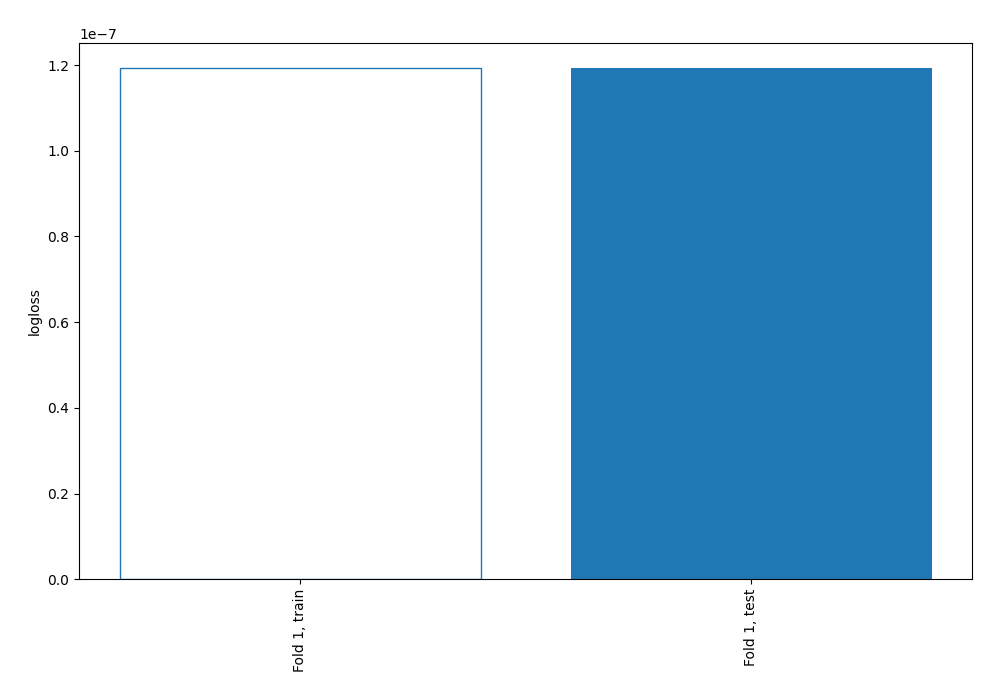
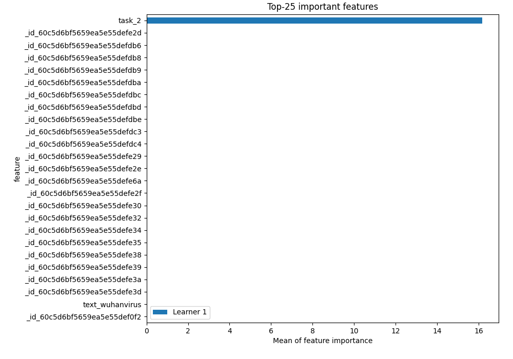
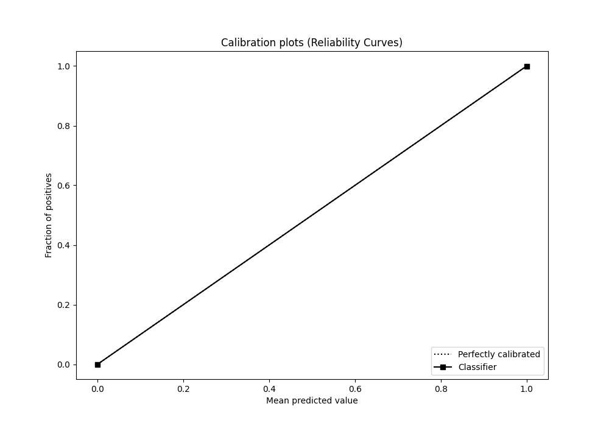

# Summary of 2_DecisionTree

[<< Go back](../README.md)

## Decision Tree
- **n_jobs**: -1
- **criterion**: gini
- **max_depth**: 3
- **explain_level**: 2

## Validation
 - **validation_type**: split
 - **train_ratio**: 0.75
 - **shuffle**: True
 - **stratify**: True

## Optimized metric
logloss

## Training time

32.1 seconds

## Metric details
|           |       score |   threshold |
|:----------|------------:|------------:|
| logloss   | 1.19209e-07 |         nan |
| auc       | 1           |         nan |
| f1        | 1           |           0 |
| accuracy  | 1           |           0 |
| precision | 1           |           0 |
| recall    | 1           |           0 |
| mcc       | 1           |           0 |

## Metric details with threshold from accuracy metric
|           |       score |   threshold |
|:----------|------------:|------------:|
| logloss   | 1.19209e-07 |         nan |
| auc       | 1           |         nan |
| f1        | 1           |           0 |
| accuracy  | 1           |           0 |
| precision | 1           |           0 |
| recall    | 1           |           0 |
| mcc       | 1           |           0 |

## Confusion matrix (at threshold=0.0)
|                |   Predicted as HOF |   Predicted as NOT |
|:---------------|-------------------:|-------------------:|
| Labeled as HOF |                625 |                  0 |
| Labeled as NOT |                  0 |                336 |

## Learning curves

## Permutation-based Importance

## Confusion Matrix

## Normalized Confusion Matrix

## ROC Curve

## Kolmogorov-Smirnov Statistic

## Precision-Recall Curve

## Calibration Curve

## Cumulative Gains Curve

## Lift Curve

[<< Go back](../README.md)
