# Summary of 3_Linear

[<< Go back](../README.md)

## Logistic Regression (Linear)
- **n_jobs**: -1
- **explain_level**: 2

## Validation
 - **validation_type**: split
 - **train_ratio**: 0.75
 - **shuffle**: True
 - **stratify**: True

## Optimized metric
logloss

## Training time

21.2 seconds

## Metric details
|           |    score |     threshold |
|:----------|---------:|--------------:|
| logloss   | 0.469279 | nan           |
| auc       | 0.844481 | nan           |
| f1        | 0.712121 |   0.271711    |
| accuracy  | 0.782518 |   0.506042    |
| precision | 0.820513 |   0.864119    |
| recall    | 1        |   0.000208186 |
| mcc       | 0.535619 |   0.271711    |

## Metric details with threshold from accuracy metric
|           |    score |   threshold |
|:----------|---------:|------------:|
| logloss   | 0.469279 |  nan        |
| auc       | 0.844481 |  nan        |
| f1        | 0.672926 |    0.506042 |
| accuracy  | 0.782518 |    0.506042 |
| precision | 0.709571 |    0.506042 |
| recall    | 0.639881 |    0.506042 |
| mcc       | 0.512208 |    0.506042 |

## Confusion matrix (at threshold=0.506042)
|                |   Predicted as HOF |   Predicted as NOT |
|:---------------|-------------------:|-------------------:|
| Labeled as HOF |                537 |                 88 |
| Labeled as NOT |                121 |                215 |

## Learning curves
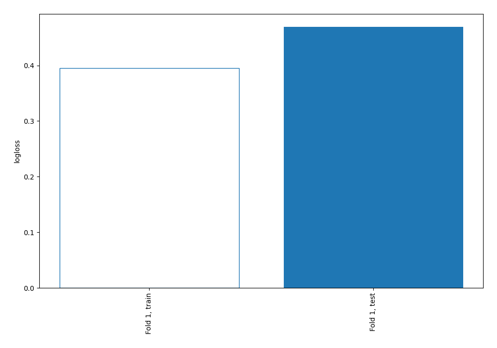

## Permutation-based Importance
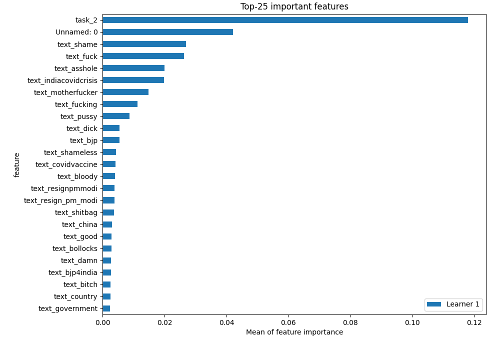
## Confusion Matrix

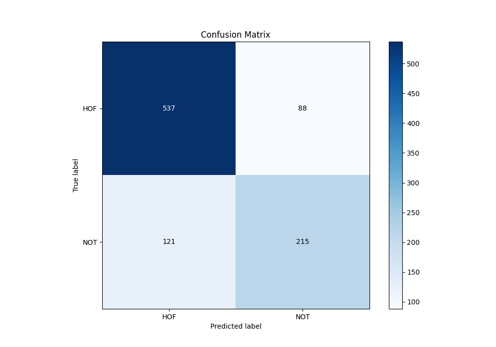

## Normalized Confusion Matrix

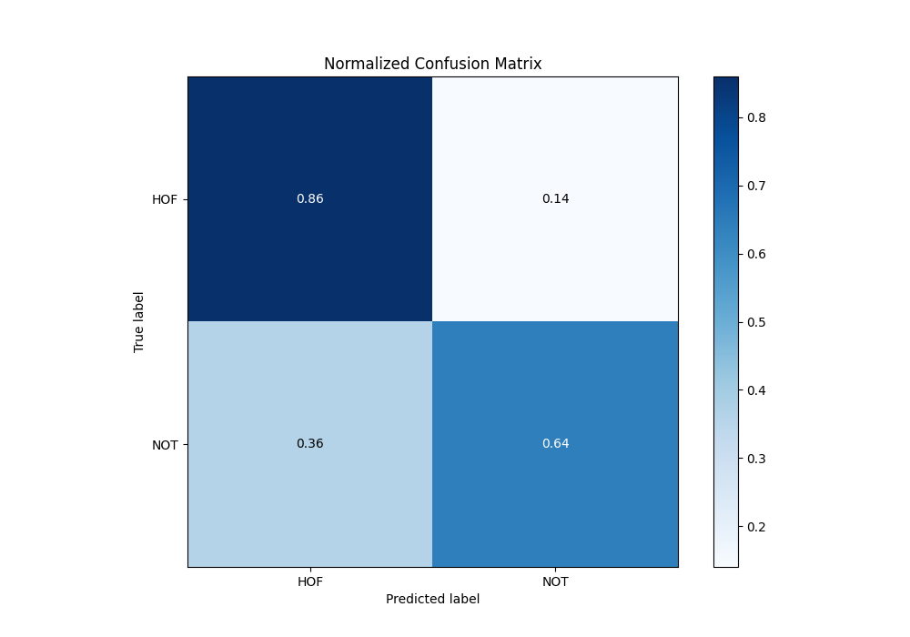

## ROC Curve

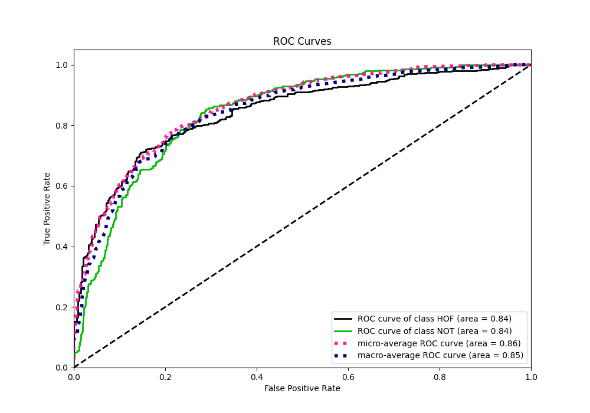

## Kolmogorov-Smirnov Statistic

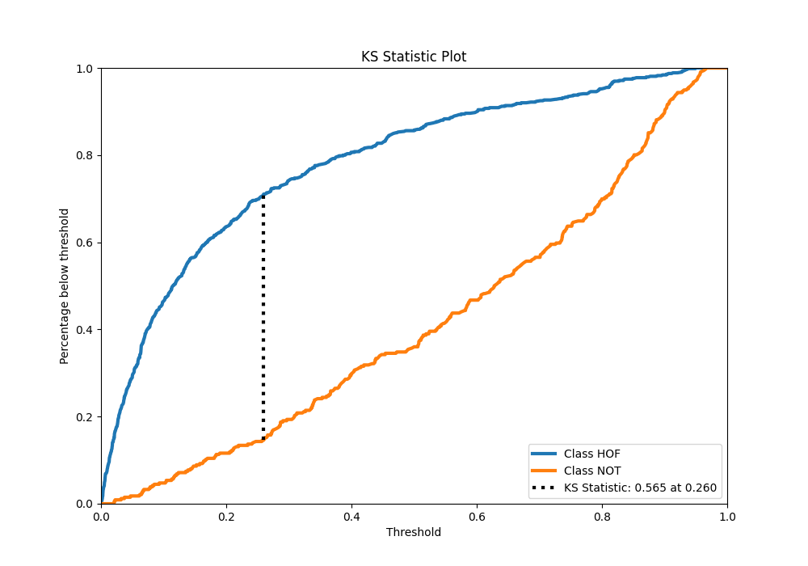

## Precision-Recall Curve

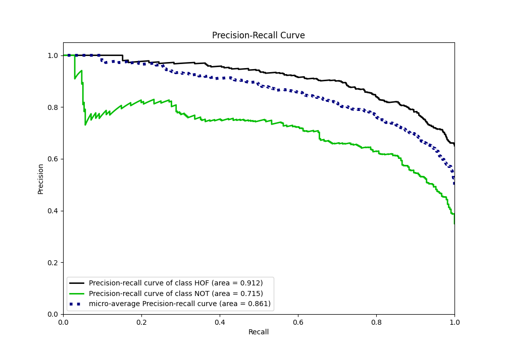

## Calibration Curve

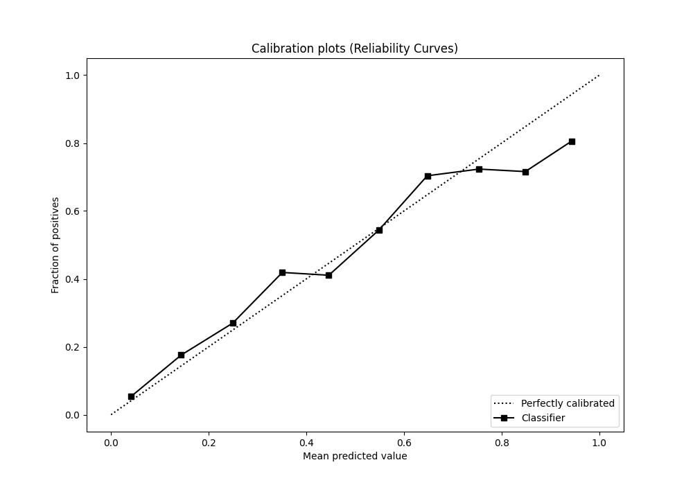

## Cumulative Gains Curve

## Lift Curve

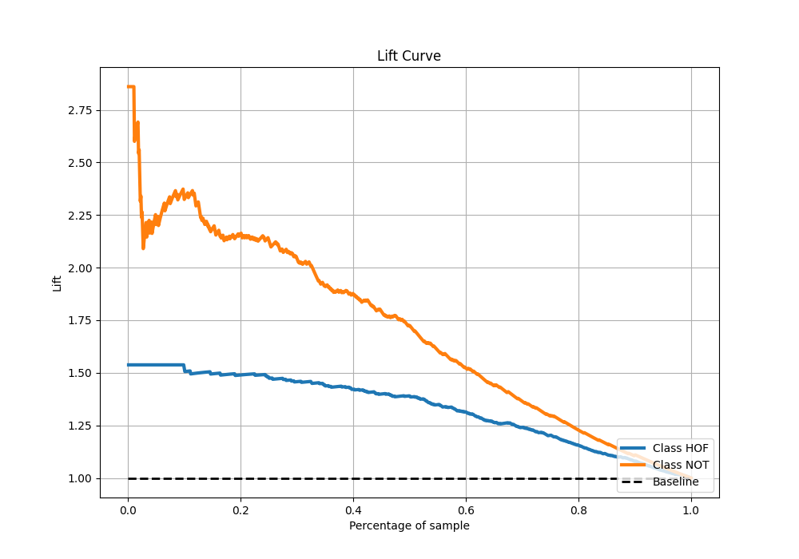

## SHAP Importance
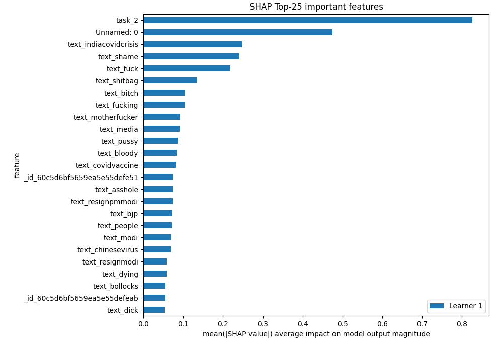

## SHAP Dependence plots

### Dependence (Fold 1)
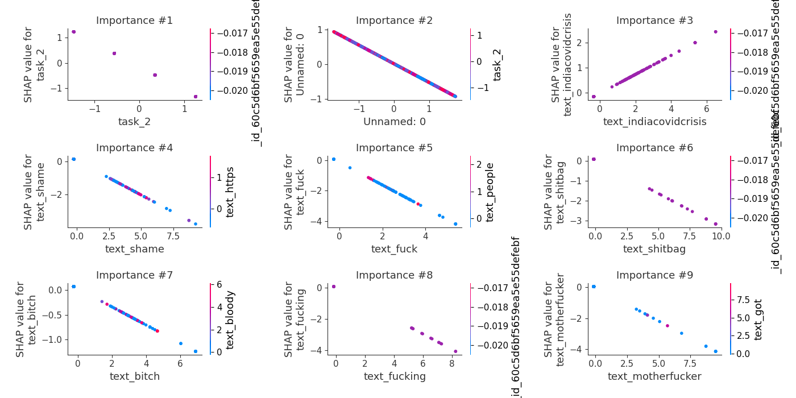

## SHAP Decision plots

### Top-10 Worst decisions for class 0 (Fold 1)
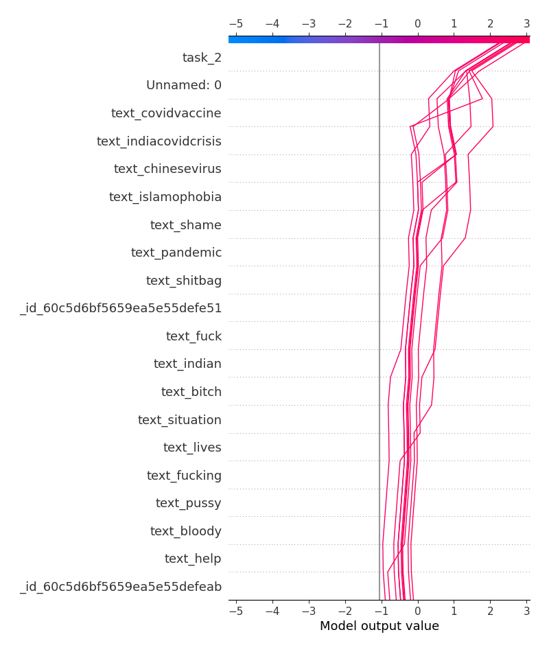
### Top-10 Best decisions for class 0 (Fold 1)
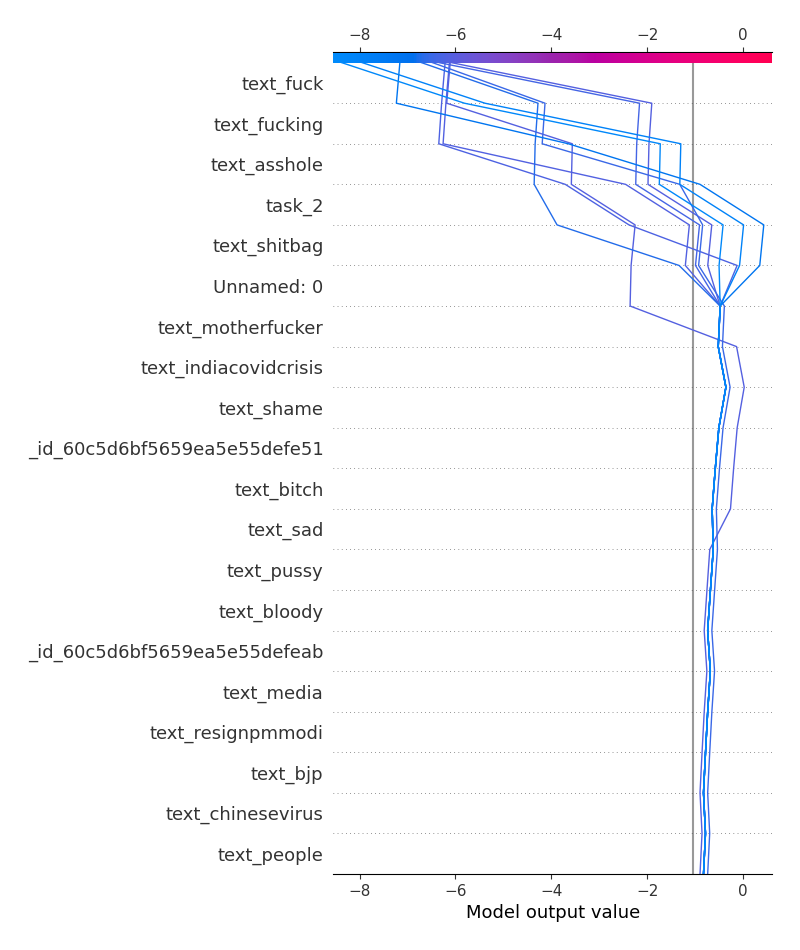
### Top-10 Worst decisions for class 1 (Fold 1)
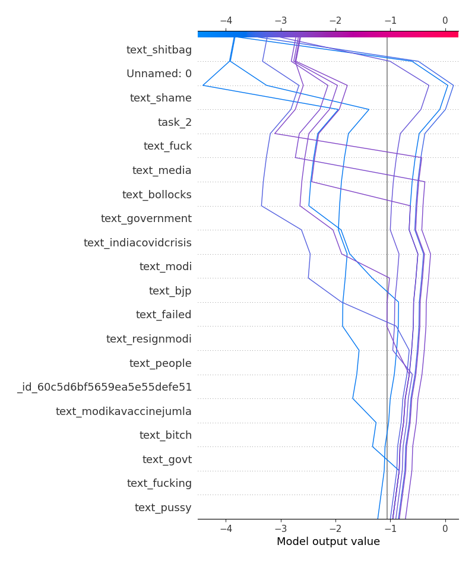
### Top-10 Best decisions for class 1 (Fold 1)
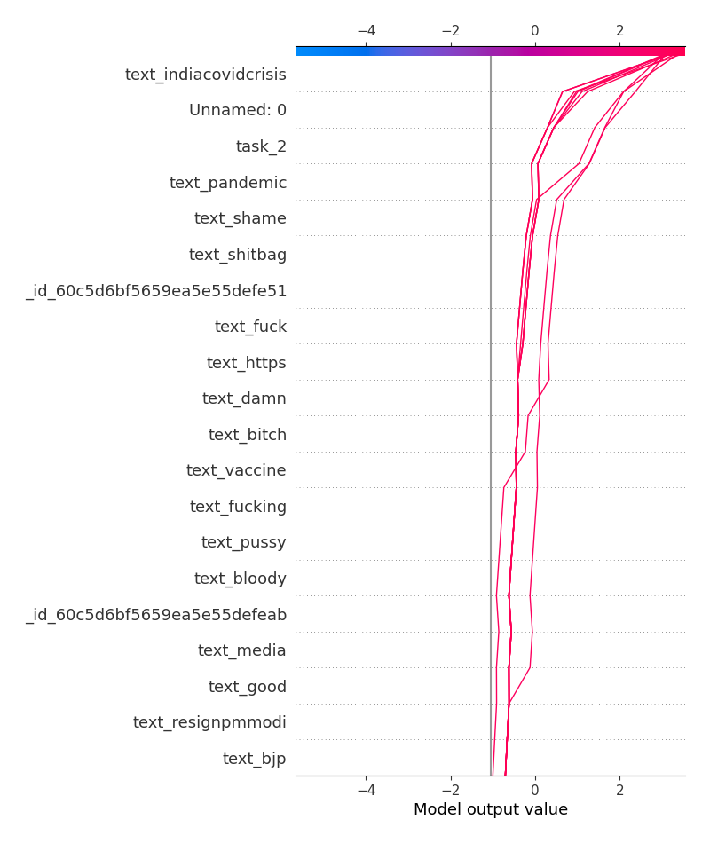

[<< Go back](../README.md)
