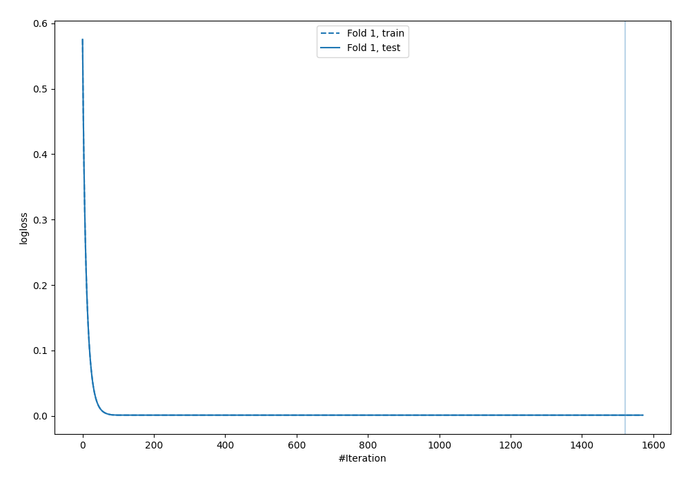
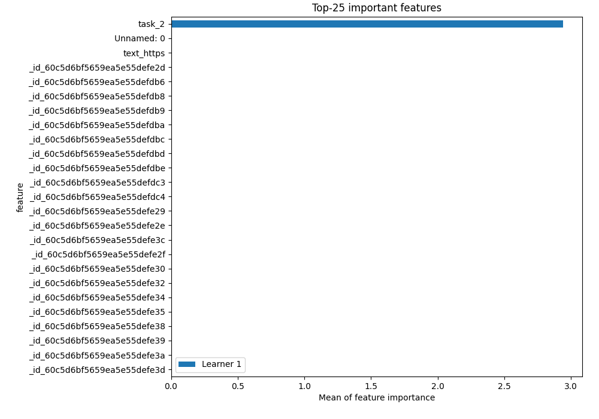
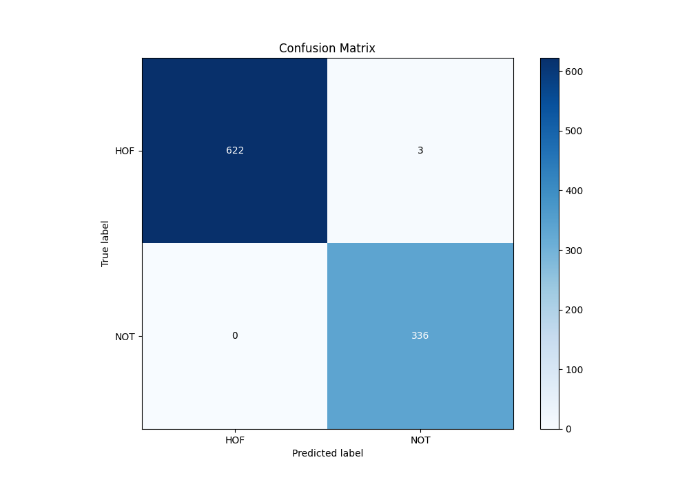
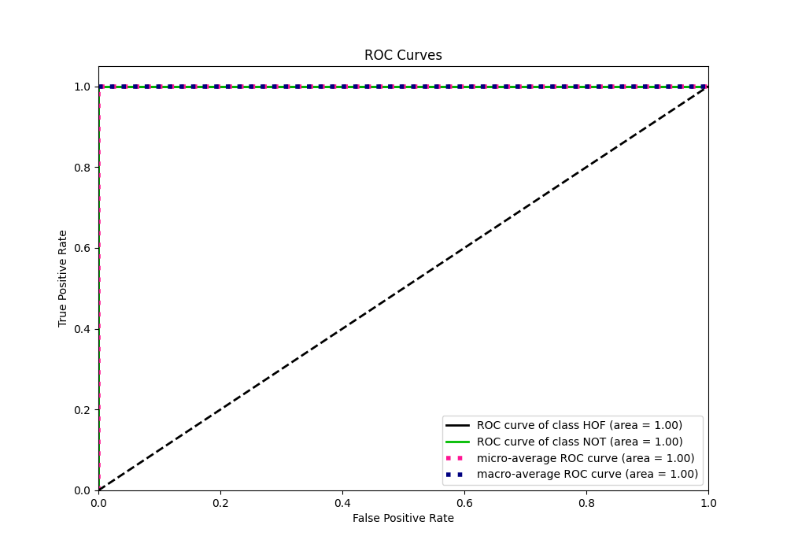
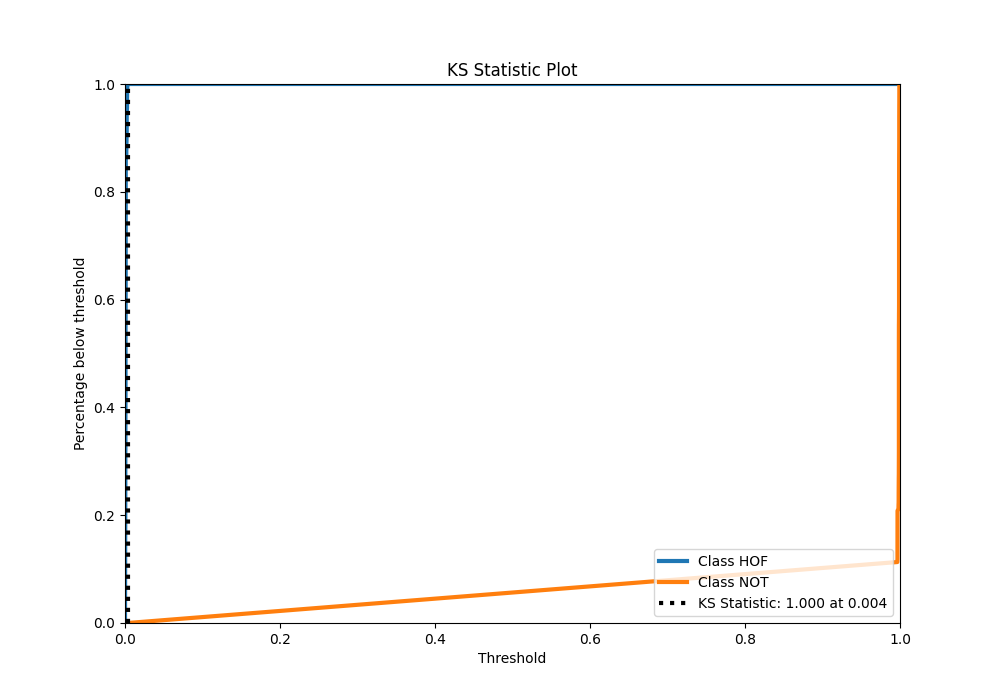
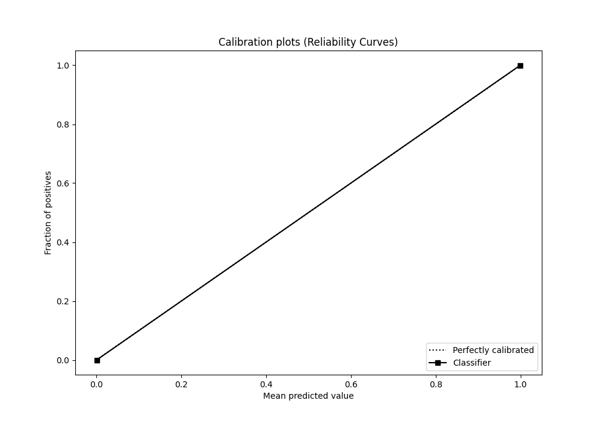
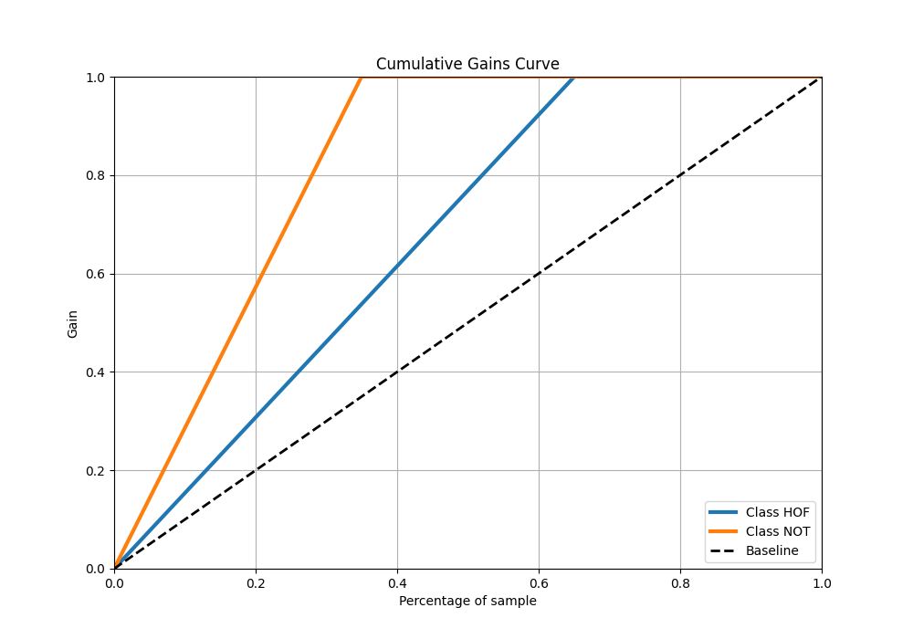
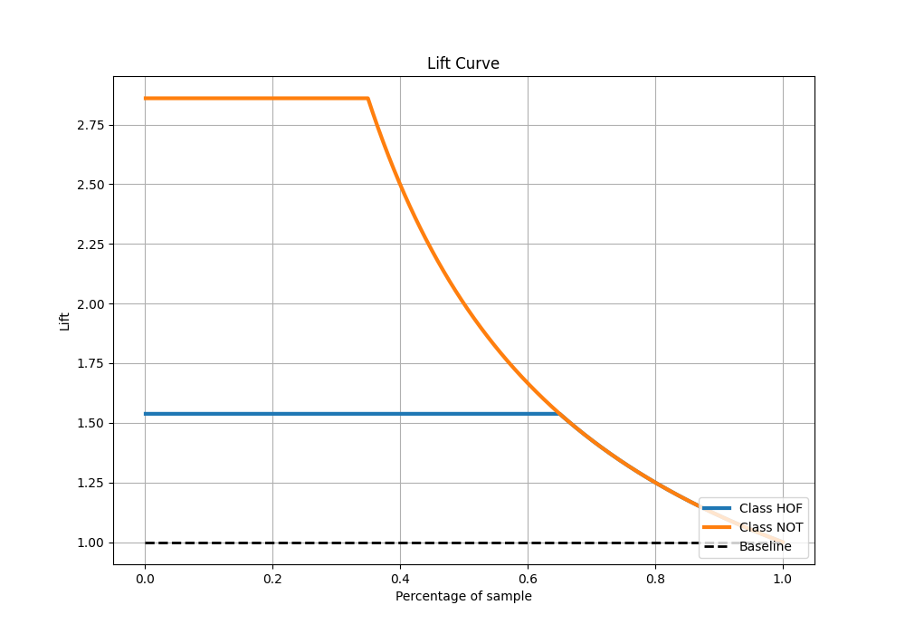

# Summary of 4_Default_Xgboost

[<< Go back](../README.md)

## Extreme Gradient Boosting (Xgboost)
- **n_jobs**: -1
- **objective**: binary:logistic
- **eta**: 0.075
- **max_depth**: 6
- **min_child_weight**: 1
- **subsample**: 1.0
- **colsample_bytree**: 1.0
- **eval_metric**: logloss
- **explain_level**: 2

## Validation
 - **validation_type**: split
 - **train_ratio**: 0.75
 - **shuffle**: True
 - **stratify**: True

## Optimized metric
logloss

## Training time

50.6 seconds

## Metric details
|           |      score |     threshold |
|:----------|-----------:|--------------:|
| logloss   | 0.00116884 | nan           |
| auc       | 1          | nan           |
| f1        | 0.995556   |   0.00305488  |
| accuracy  | 0.996878   |   0.00305488  |
| precision | 1          |   0.996546    |
| recall    | 1          |   0.000350143 |
| mcc       | 0.993173   |   0.00305488  |

## Metric details with threshold from accuracy metric
|           |      score |    threshold |
|:----------|-----------:|-------------:|
| logloss   | 0.00116884 | nan          |
| auc       | 1          | nan          |
| f1        | 0.995556   |   0.00305488 |
| accuracy  | 0.996878   |   0.00305488 |
| precision | 0.99115    |   0.00305488 |
| recall    | 1          |   0.00305488 |
| mcc       | 0.993173   |   0.00305488 |

## Confusion matrix (at threshold=0.003055)
|                |   Predicted as HOF |   Predicted as NOT |
|:---------------|-------------------:|-------------------:|
| Labeled as HOF |                622 |                  3 |
| Labeled as NOT |                  0 |                336 |

## Learning curves

## Permutation-based Importance

## Confusion Matrix

## Normalized Confusion Matrix

## ROC Curve

## Kolmogorov-Smirnov Statistic

## Precision-Recall Curve

## Calibration Curve

## Cumulative Gains Curve

## Lift Curve

[<< Go back](../README.md)
