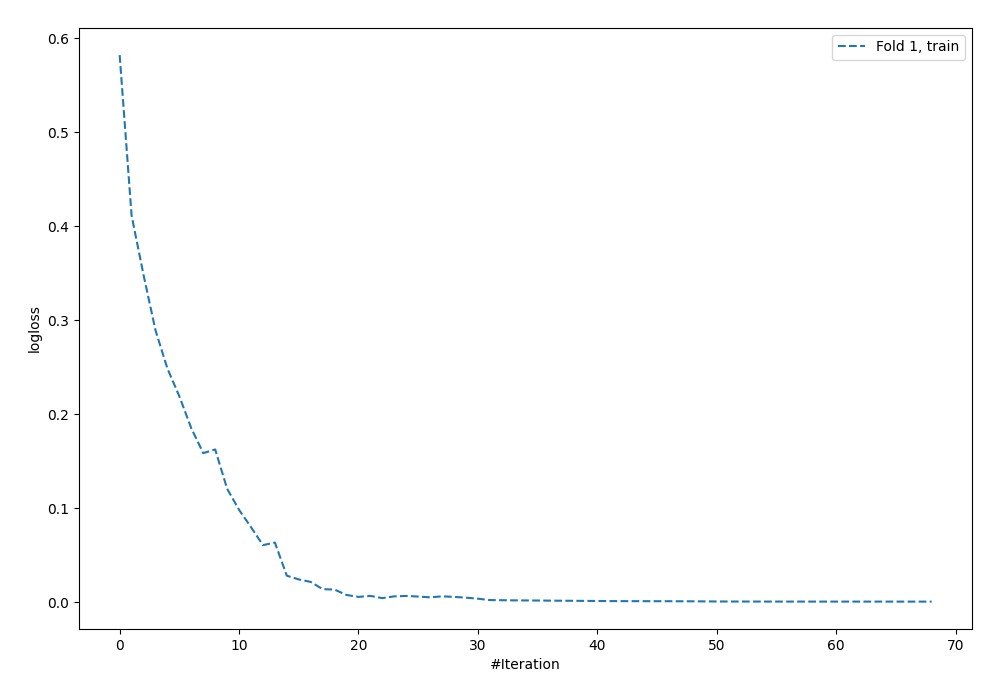
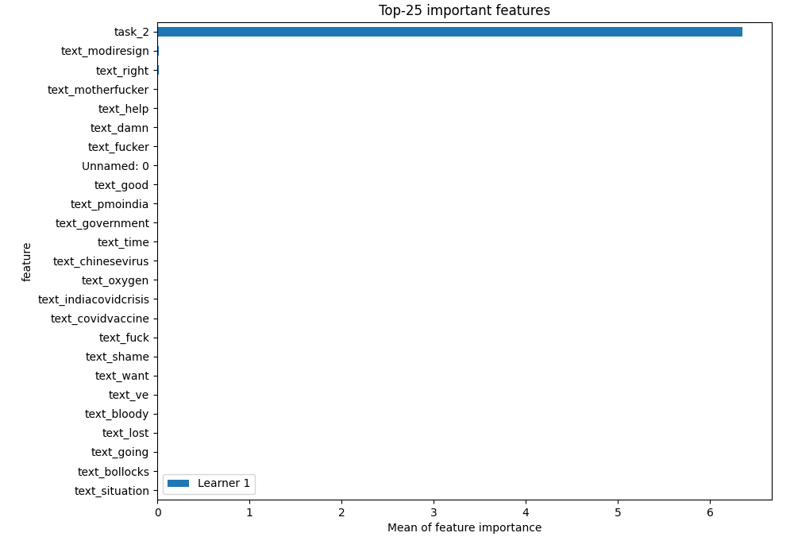
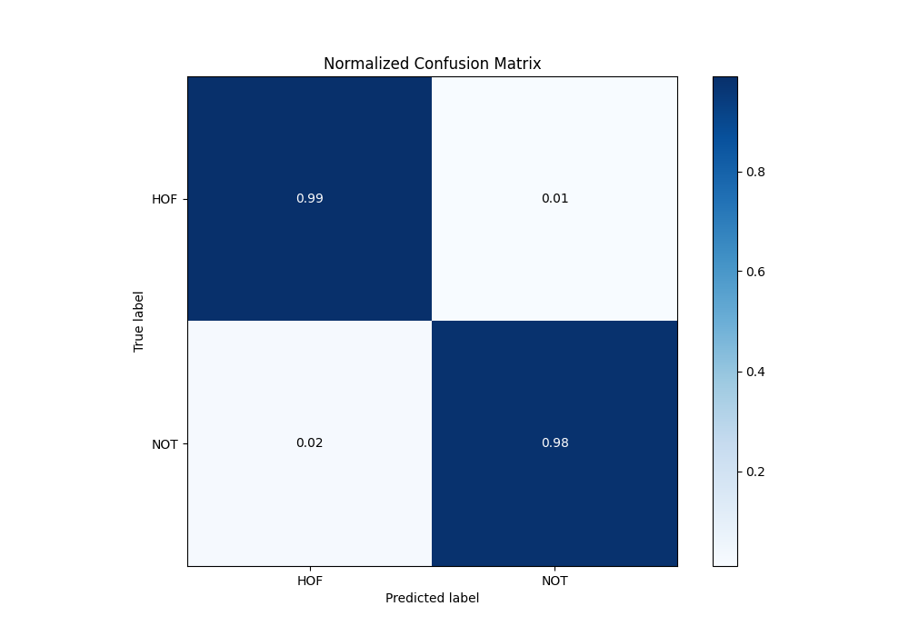
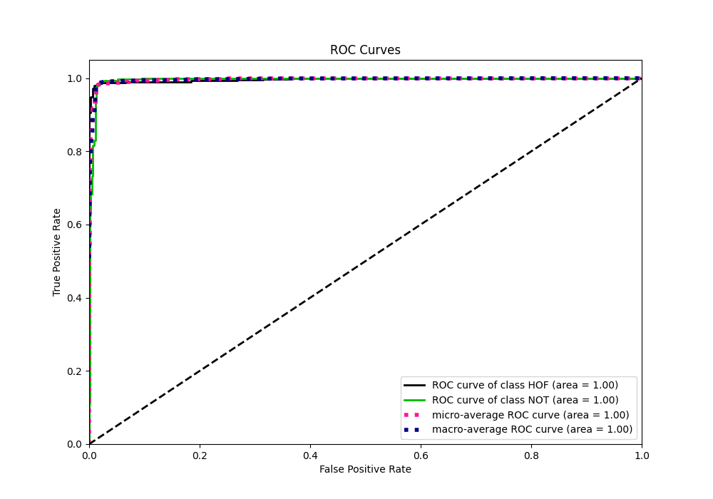
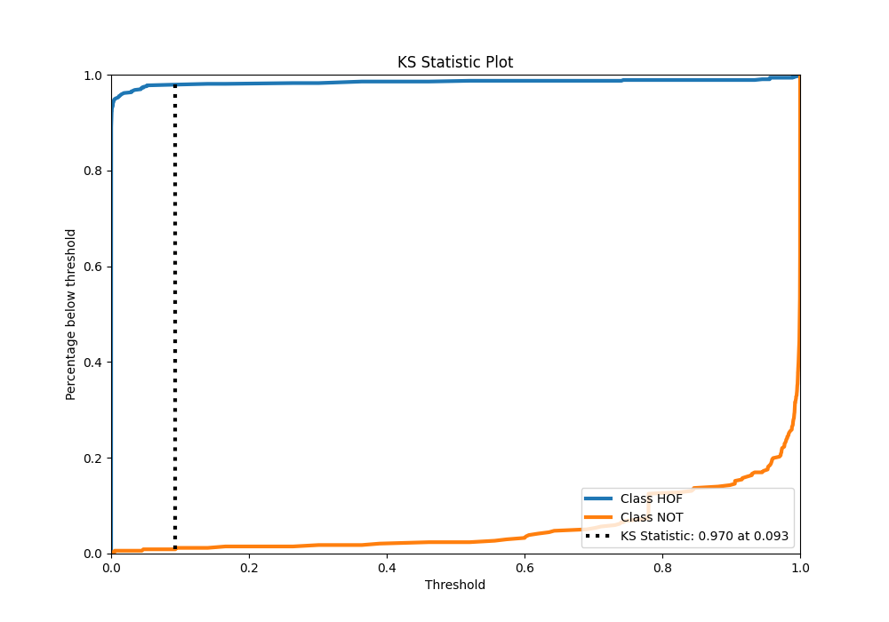
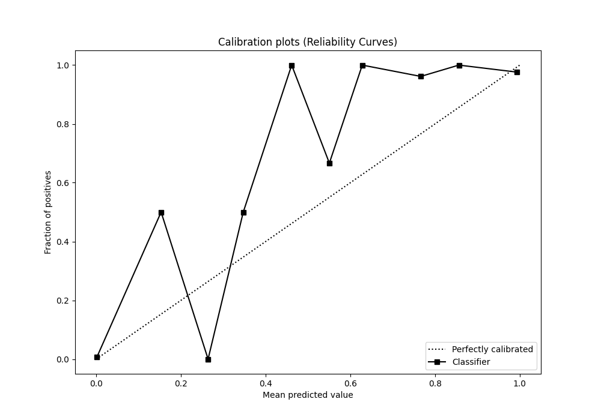
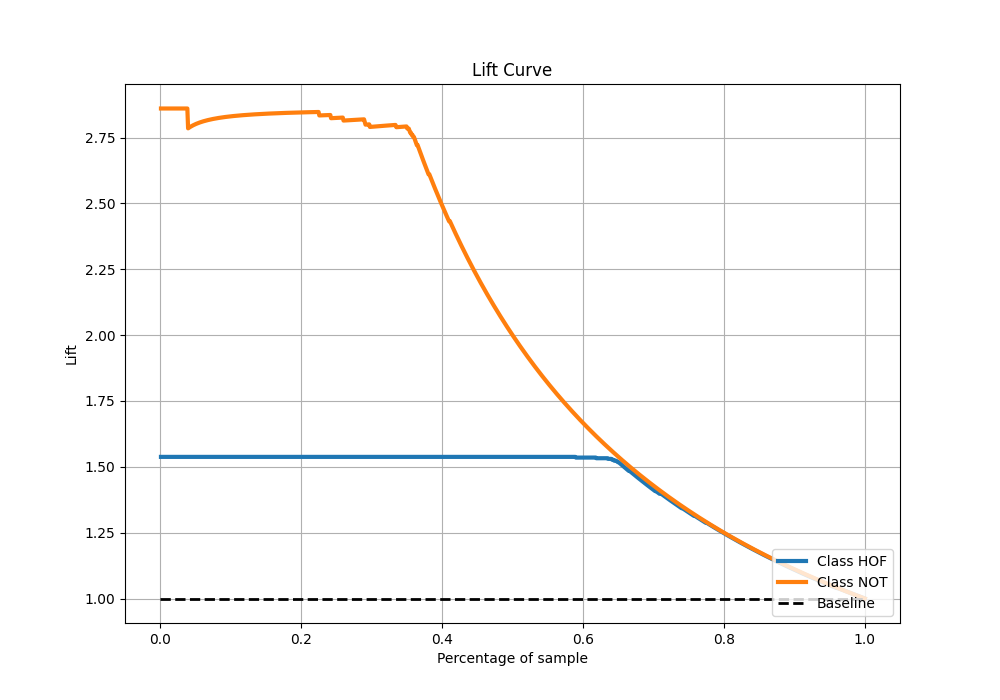

# Summary of 5_Default_NeuralNetwork

[<< Go back](../README.md)

## Neural Network
- **n_jobs**: -1
- **dense_1_size**: 32
- **dense_2_size**: 16
- **learning_rate**: 0.05
- **explain_level**: 2

## Validation
 - **validation_type**: split
 - **train_ratio**: 0.75
 - **shuffle**: True
 - **stratify**: True

## Optimized metric
logloss

## Training time

17.0 seconds

## Metric details
|           |     score |     threshold |
|:----------|----------:|--------------:|
| logloss   | 0.0843146 | nan           |
| auc       | 0.995633  | nan           |
| f1        | 0.977778  |   0.37675     |
| accuracy  | 0.984391  |   0.37675     |
| precision | 0.995305  |   0.996726    |
| recall    | 1         |   1.00464e-45 |
| mcc       | 0.965772  |   0.37675     |

## Metric details with threshold from accuracy metric
|           |     score |   threshold |
|:----------|----------:|------------:|
| logloss   | 0.0843146 |   nan       |
| auc       | 0.995633  |   nan       |
| f1        | 0.977778  |     0.37675 |
| accuracy  | 0.984391  |     0.37675 |
| precision | 0.973451  |     0.37675 |
| recall    | 0.982143  |     0.37675 |
| mcc       | 0.965772  |     0.37675 |

## Confusion matrix (at threshold=0.37675)
|                |   Predicted as HOF |   Predicted as NOT |
|:---------------|-------------------:|-------------------:|
| Labeled as HOF |                616 |                  9 |
| Labeled as NOT |                  6 |                330 |

## Learning curves

## Permutation-based Importance

## Confusion Matrix

## Normalized Confusion Matrix

## ROC Curve

## Kolmogorov-Smirnov Statistic

## Precision-Recall Curve

## Calibration Curve

## Cumulative Gains Curve

## Lift Curve

[<< Go back](../README.md)
