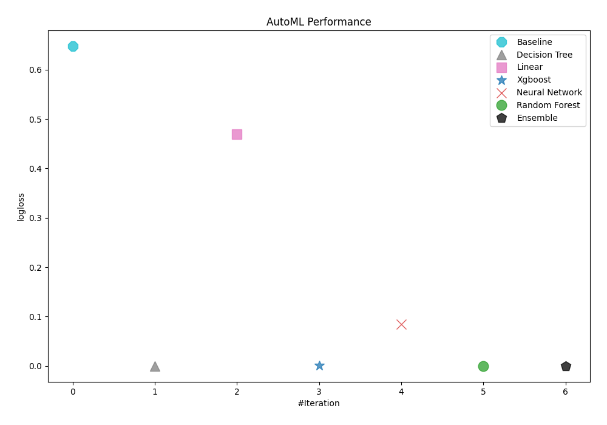
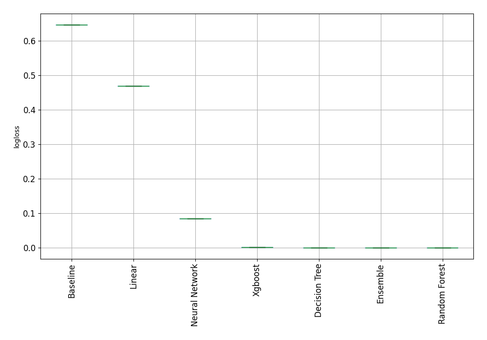
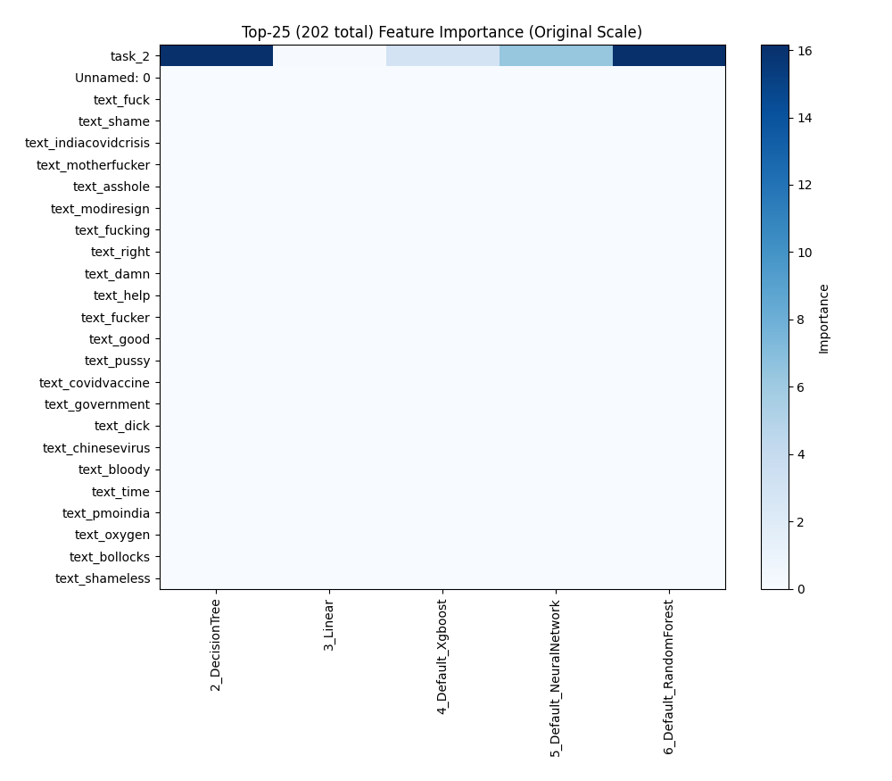
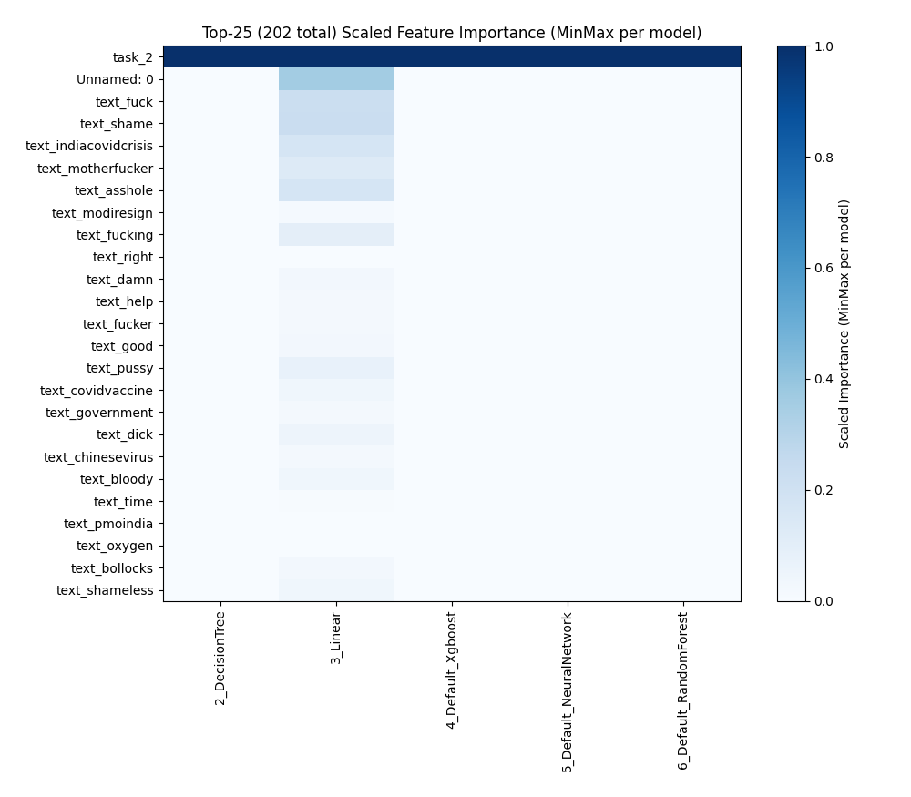
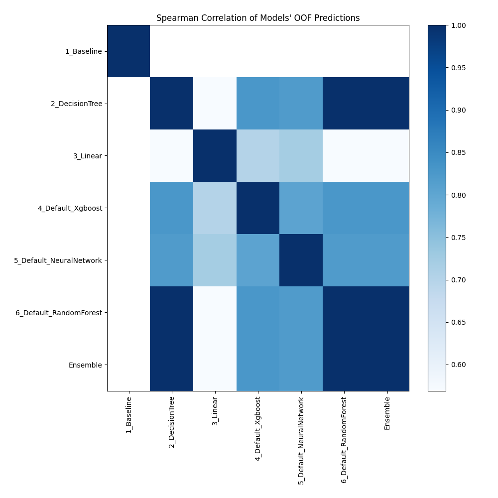

# AutoML Leaderboard

| Best model   | name                                                         | model_type     | metric_type   |   metric_value |   train_time |
|:-------------|:-------------------------------------------------------------|:---------------|:--------------|---------------:|-------------:|
|              | [1_Baseline](1_Baseline/README.md)                           | Baseline       | logloss       |    0.647222    |         1.61 |
| **the best** | [2_DecisionTree](2_DecisionTree/README.md)                   | Decision Tree  | logloss       |    1.19209e-07 |        33.52 |
|              | [3_Linear](3_Linear/README.md)                               | Linear         | logloss       |    0.469279    |        24.83 |
|              | [4_Default_Xgboost](4_Default_Xgboost/README.md)             | Xgboost        | logloss       |    0.00116884  |        52.58 |
|              | [5_Default_NeuralNetwork](5_Default_NeuralNetwork/README.md) | Neural Network | logloss       |    0.0843146   |        18.93 |
|              | [6_Default_RandomForest](6_Default_RandomForest/README.md)   | Random Forest  | logloss       |    1.19209e-07 |        44.33 |
|              | [Ensemble](Ensemble/README.md)                               | Ensemble       | logloss       |    1.19209e-07 |         3.61 |

### AutoML Performance

### AutoML Performance Boxplot

### Features Importance (Original Scale)

### Scaled Features Importance (MinMax per Model)

### Spearman Correlation of Models

