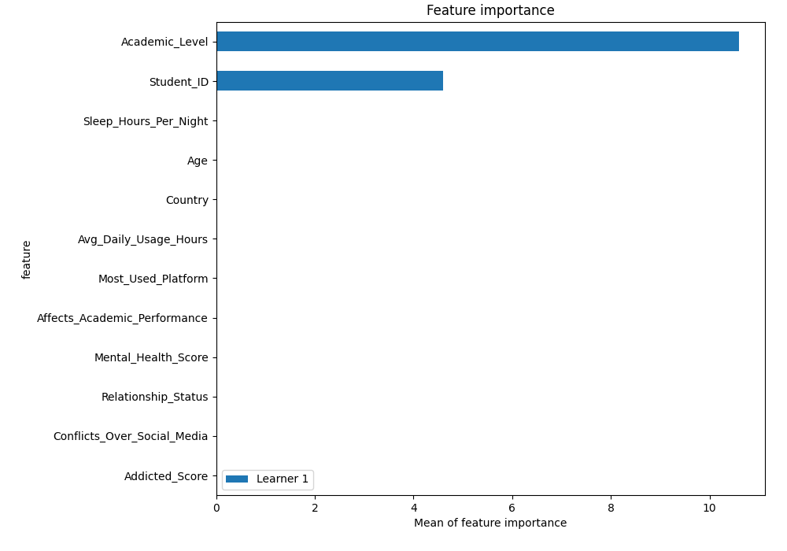
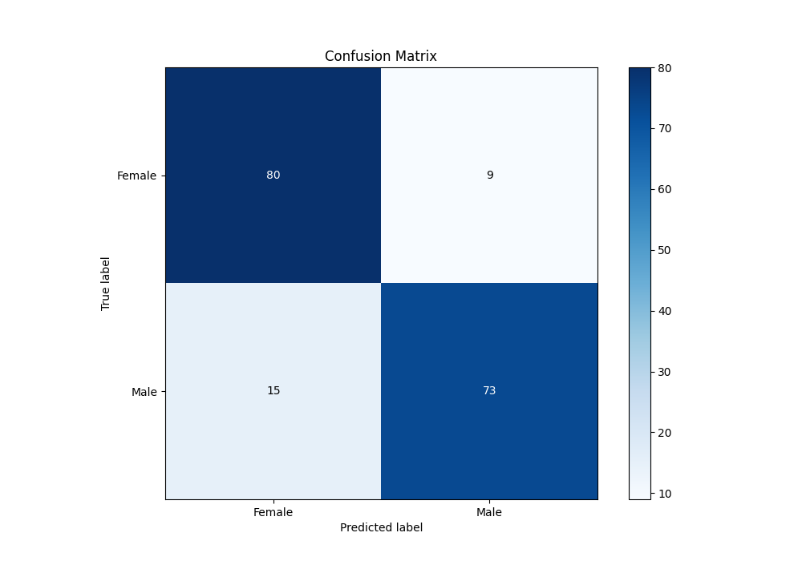
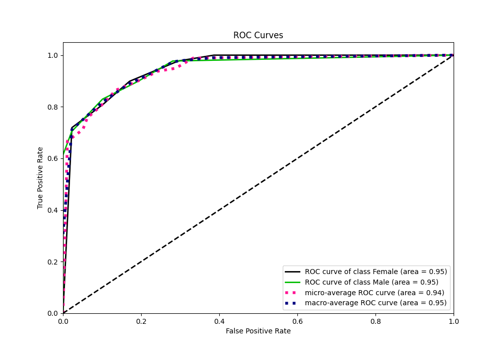
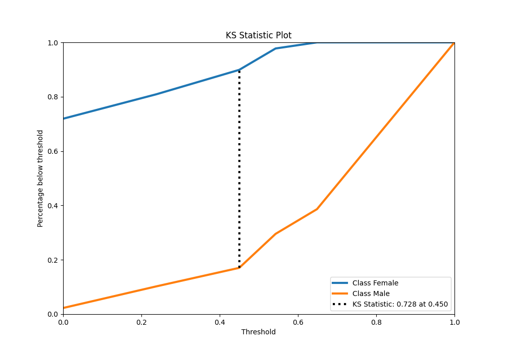
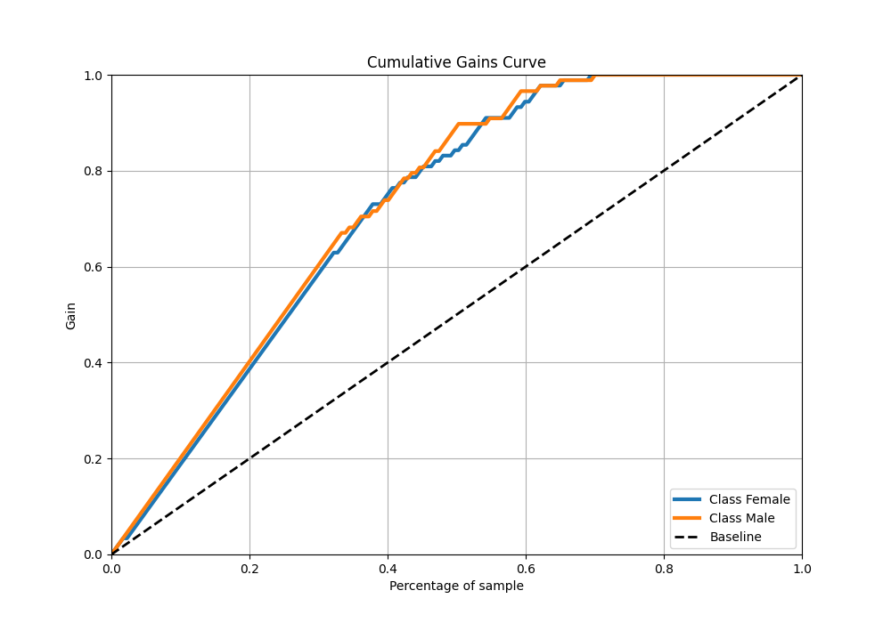

# Summary of 2_DecisionTree

[<< Go back](../README.md)

## Decision Tree
- **n_jobs**: -1
- **criterion**: gini
- **max_depth**: 3
- **explain_level**: 2

## Validation
 - **validation_type**: split
 - **train_ratio**: 0.75
 - **shuffle**: True
 - **stratify**: True

## Optimized metric
logloss

## Training time

6.2 seconds

## Metric details
|           |    score |   threshold |
|:----------|---------:|------------:|
| logloss   | 0.403581 |  nan        |
| auc       | 0.94797  |  nan        |
| f1        | 0.864322 |    0        |
| accuracy  | 0.864407 |    0.45     |
| precision | 0.96875  |    0.542857 |
| recall    | 0.977273 |    0        |
| mcc       | 0.730383 |    0.45     |

## Metric details with threshold from accuracy metric
|           |    score |   threshold |
|:----------|---------:|------------:|
| logloss   | 0.403581 |      nan    |
| auc       | 0.94797  |      nan    |
| f1        | 0.858824 |        0.45 |
| accuracy  | 0.864407 |        0.45 |
| precision | 0.890244 |        0.45 |
| recall    | 0.829545 |        0.45 |
| mcc       | 0.730383 |        0.45 |

## Confusion matrix (at threshold=0.45)
|                   |   Predicted as Female |   Predicted as Male |
|:------------------|----------------------:|--------------------:|
| Labeled as Female |                    80 |                   9 |
| Labeled as Male   |                    15 |                  73 |

## Learning curves

## Permutation-based Importance

## Confusion Matrix

## Normalized Confusion Matrix

## ROC Curve

## Kolmogorov-Smirnov Statistic

## Precision-Recall Curve

## Calibration Curve

## Cumulative Gains Curve

## Lift Curve

[<< Go back](../README.md)
