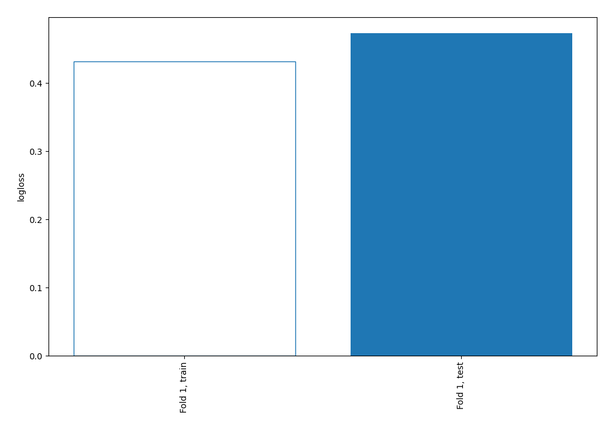
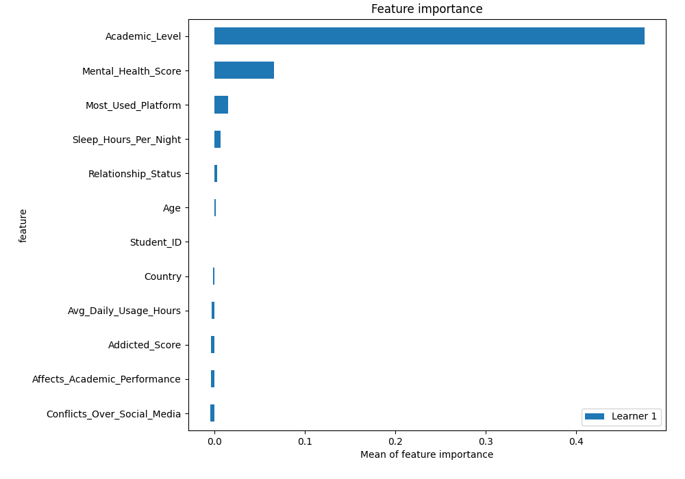
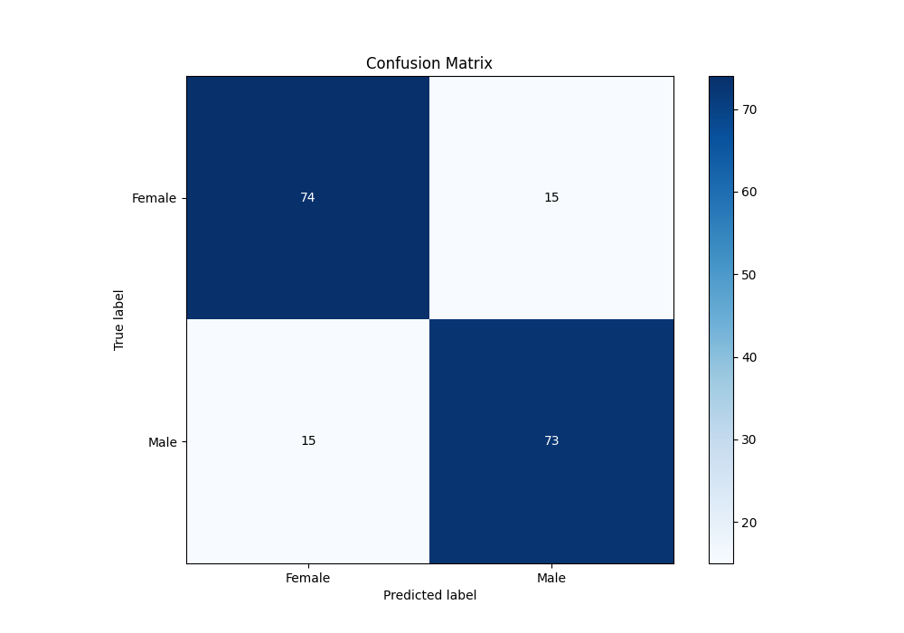
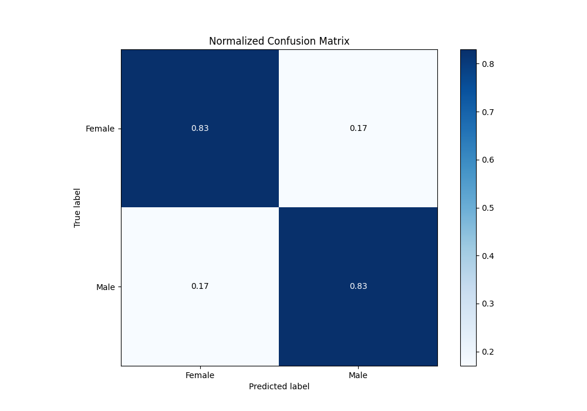
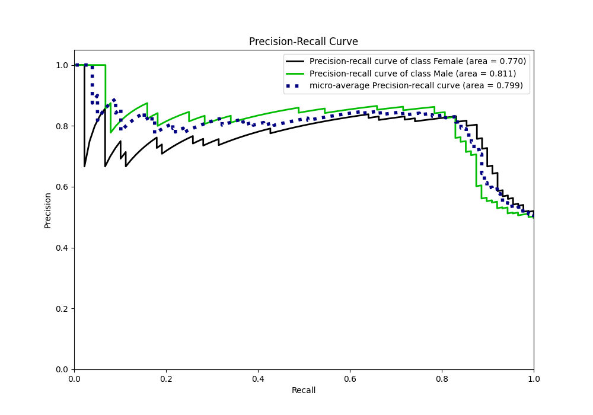
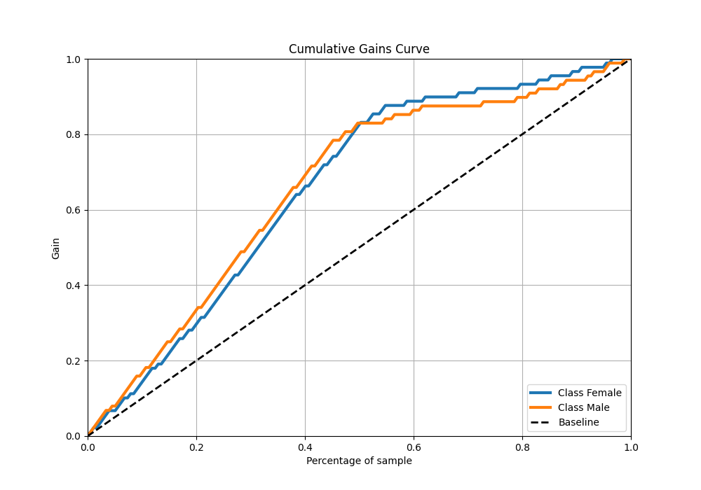
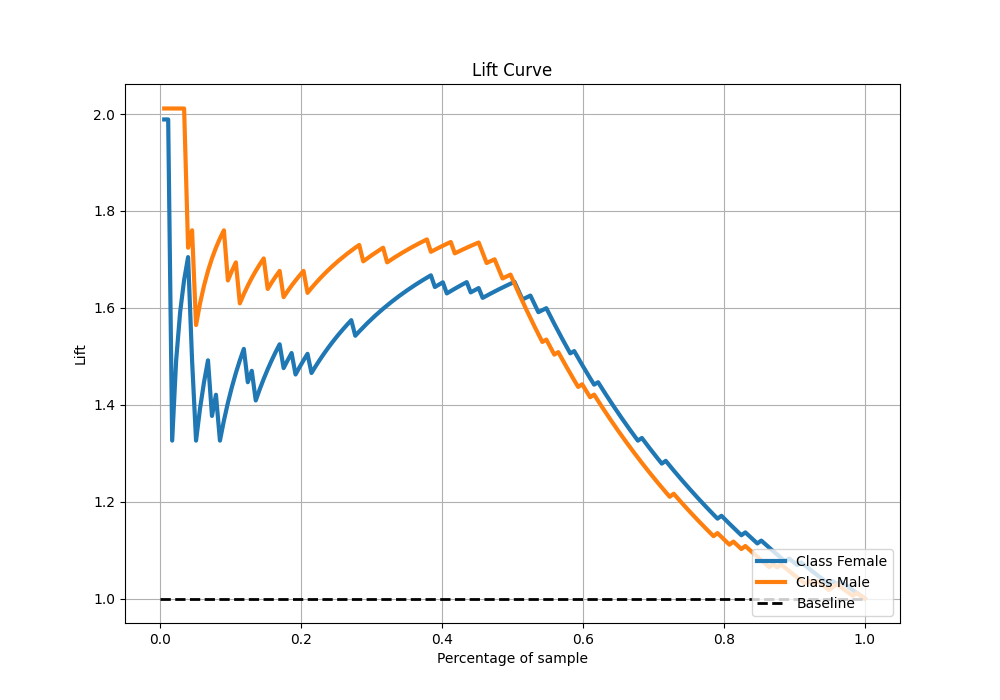
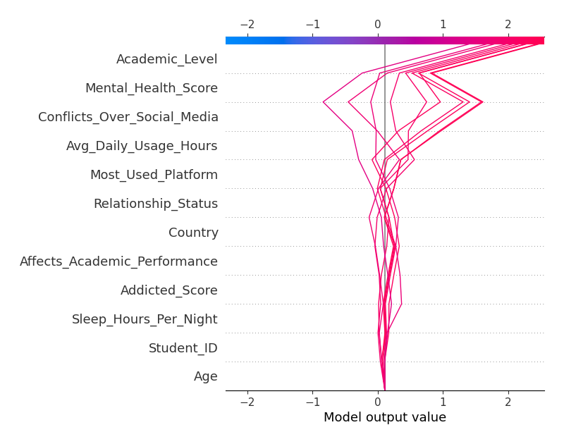
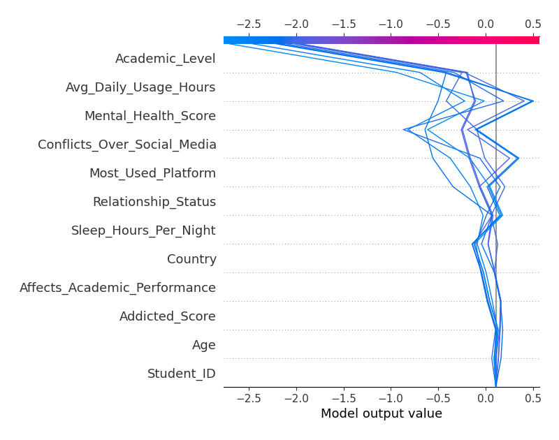

# Summary of 3_Linear

[<< Go back](../README.md)

## Logistic Regression (Linear)
- **n_jobs**: -1
- **explain_level**: 2

## Validation
 - **validation_type**: split
 - **train_ratio**: 0.75
 - **shuffle**: True
 - **stratify**: True

## Optimized metric
logloss

## Training time

8.8 seconds

## Metric details
|           |    score |   threshold |
|:----------|---------:|------------:|
| logloss   | 0.473065 | nan         |
| auc       | 0.822268 | nan         |
| f1        | 0.829545 |   0.27587   |
| accuracy  | 0.830508 |   0.27587   |
| precision | 0.8625   |   0.493459  |
| recall    | 1        |   0.0564716 |
| mcc       | 0.663552 |   0.493459  |

## Metric details with threshold from accuracy metric
|           |    score |   threshold |
|:----------|---------:|------------:|
| logloss   | 0.473065 |   nan       |
| auc       | 0.822268 |   nan       |
| f1        | 0.829545 |     0.27587 |
| accuracy  | 0.830508 |     0.27587 |
| precision | 0.829545 |     0.27587 |
| recall    | 0.829545 |     0.27587 |
| mcc       | 0.661006 |     0.27587 |

## Confusion matrix (at threshold=0.27587)
|                   |   Predicted as Female |   Predicted as Male |
|:------------------|----------------------:|--------------------:|
| Labeled as Female |                    74 |                  15 |
| Labeled as Male   |                    15 |                  73 |

## Learning curves

## Coefficients
| feature                      |   Learner_1 |
|:-----------------------------|------------:|
| Most_Used_Platform           |   0.35764   |
| Relationship_Status          |   0.160481  |
| intercept                    |   0.015976  |
| Age                          |  -0.0309468 |
| Student_ID                   |  -0.0338982 |
| Addicted_Score               |  -0.0520328 |
| Country                      |  -0.0650559 |
| Affects_Academic_Performance |  -0.0709022 |
| Sleep_Hours_Per_Night        |  -0.111572  |
| Avg_Daily_Usage_Hours        |  -0.325959  |
| Conflicts_Over_Social_Media  |  -0.337406  |
| Mental_Health_Score          |  -0.510191  |
| Academic_Level               |  -1.66686   |

## Permutation-based Importance

## Confusion Matrix

## Normalized Confusion Matrix

## ROC Curve

## Kolmogorov-Smirnov Statistic

## Precision-Recall Curve

## Calibration Curve

## Cumulative Gains Curve

## Lift Curve

## SHAP Importance

## SHAP Dependence plots

### Dependence (Fold 1)

## SHAP Decision plots

### Top-10 Worst decisions for class 0 (Fold 1)

### Top-10 Best decisions for class 0 (Fold 1)

### Top-10 Worst decisions for class 1 (Fold 1)

### Top-10 Best decisions for class 1 (Fold 1)

[<< Go back](../README.md)
