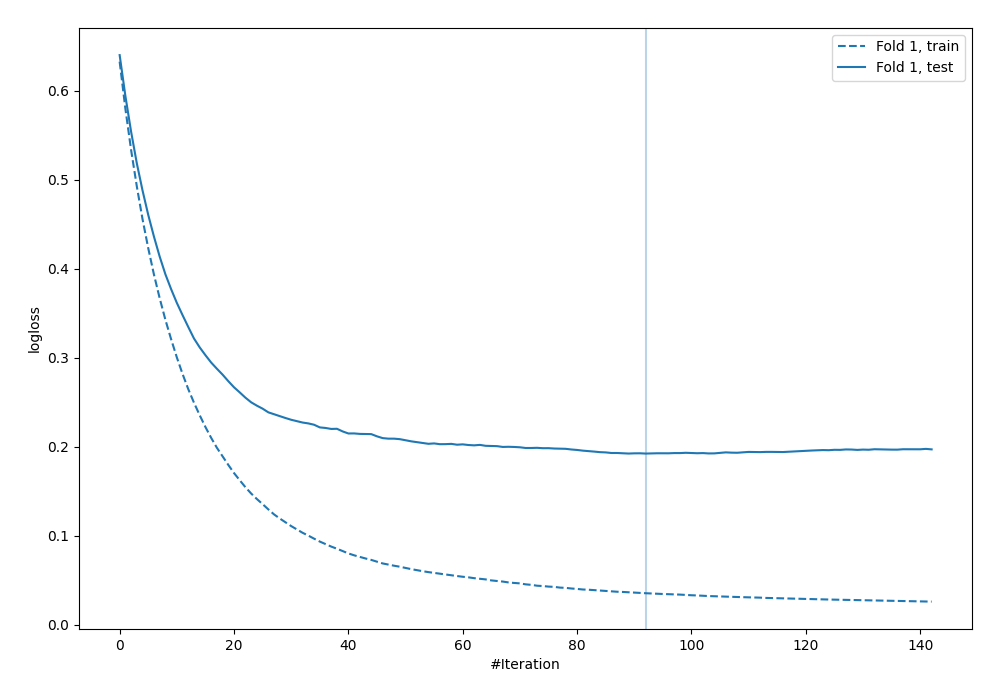
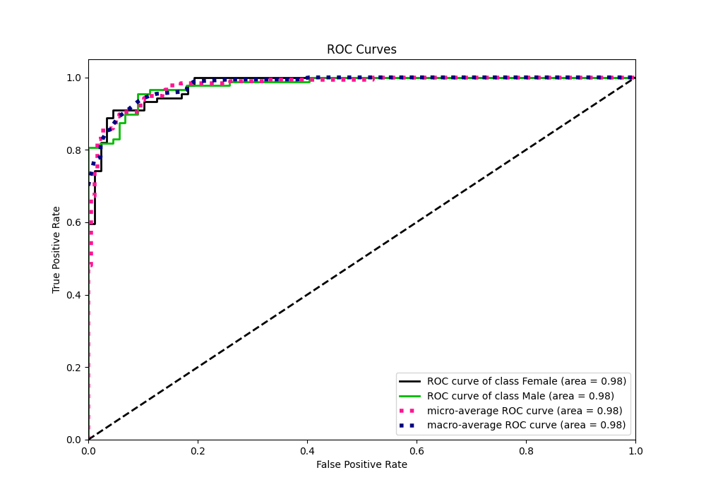
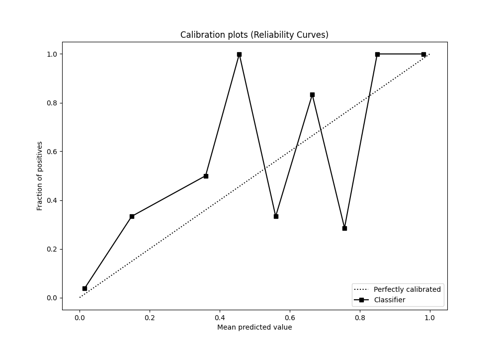
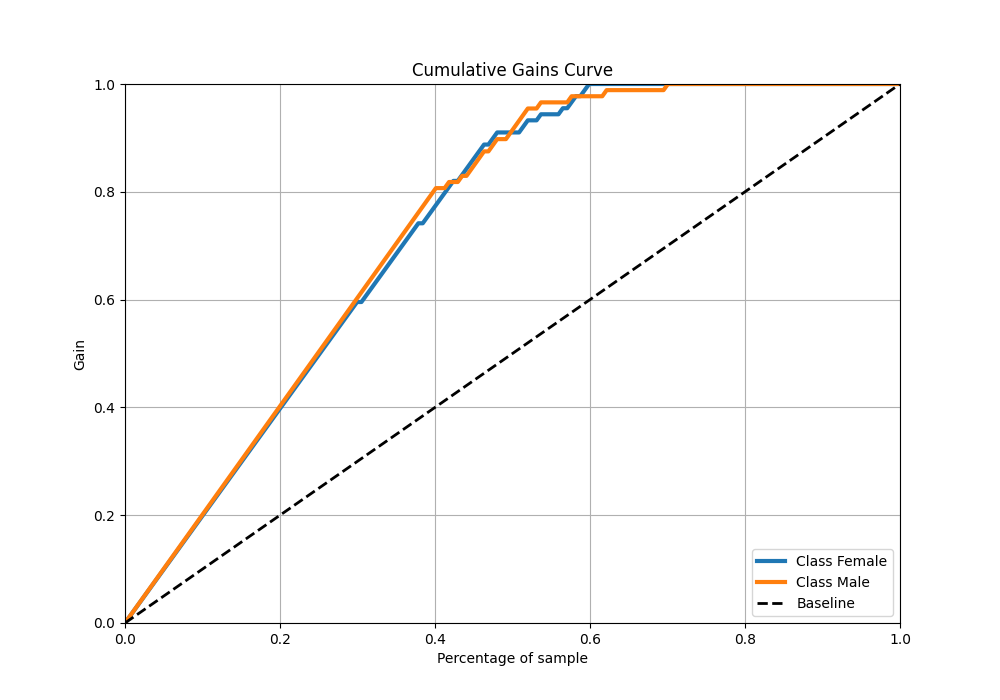

# Summary of 4_Default_Xgboost

[<< Go back](../README.md)

## Extreme Gradient Boosting (Xgboost)
- **n_jobs**: -1
- **objective**: binary:logistic
- **eta**: 0.075
- **max_depth**: 6
- **min_child_weight**: 1
- **subsample**: 1.0
- **colsample_bytree**: 1.0
- **eval_metric**: logloss
- **explain_level**: 2

## Validation
 - **validation_type**: split
 - **train_ratio**: 0.75
 - **shuffle**: True
 - **stratify**: True

## Optimized metric
logloss

## Training time

4.4 seconds

## Metric details
|           |    score |    threshold |
|:----------|---------:|-------------:|
| logloss   | 0.192219 | nan          |
| auc       | 0.979188 | nan          |
| f1        | 0.933333 |   0.36047    |
| accuracy  | 0.932203 |   0.36047    |
| precision | 0.948052 |   0.729712   |
| recall    | 1        |   0.00306991 |
| mcc       | 0.865321 |   0.36047    |

## Metric details with threshold from accuracy metric
|           |    score |   threshold |
|:----------|---------:|------------:|
| logloss   | 0.192219 |   nan       |
| auc       | 0.979188 |   nan       |
| f1        | 0.933333 |     0.36047 |
| accuracy  | 0.932203 |     0.36047 |
| precision | 0.913043 |     0.36047 |
| recall    | 0.954545 |     0.36047 |
| mcc       | 0.865321 |     0.36047 |

## Confusion matrix (at threshold=0.36047)
|                   |   Predicted as Female |   Predicted as Male |
|:------------------|----------------------:|--------------------:|
| Labeled as Female |                    81 |                   8 |
| Labeled as Male   |                     4 |                  84 |

## Learning curves

## Permutation-based Importance

## Confusion Matrix

## Normalized Confusion Matrix

## ROC Curve

## Kolmogorov-Smirnov Statistic

## Precision-Recall Curve

## Calibration Curve

## Cumulative Gains Curve

## Lift Curve

[<< Go back](../README.md)
