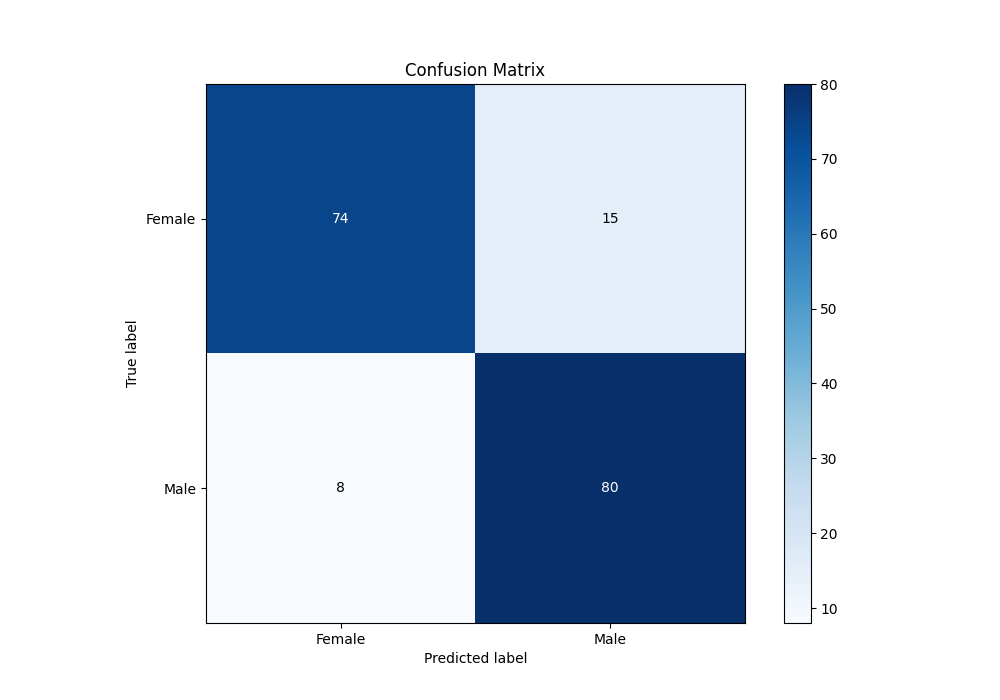
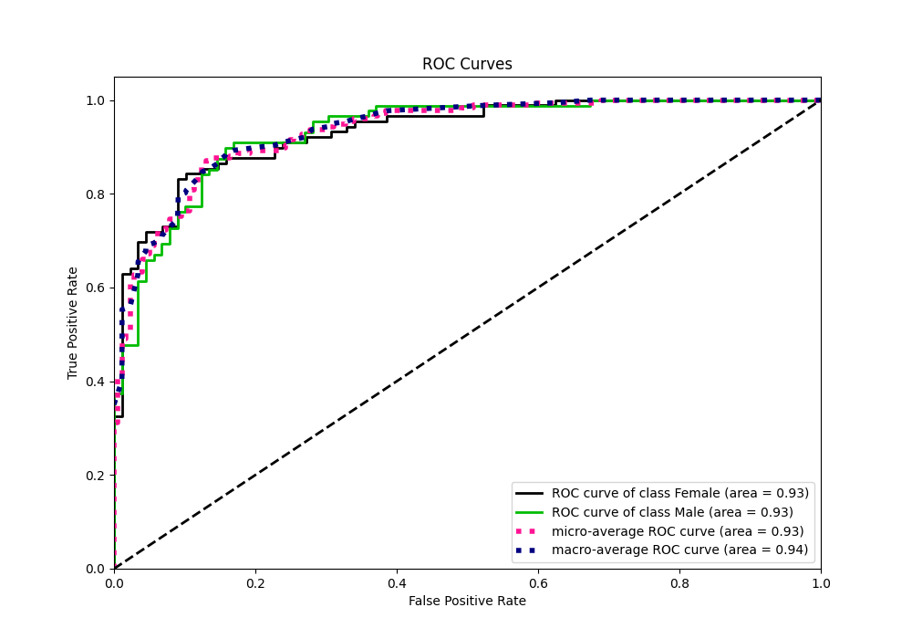
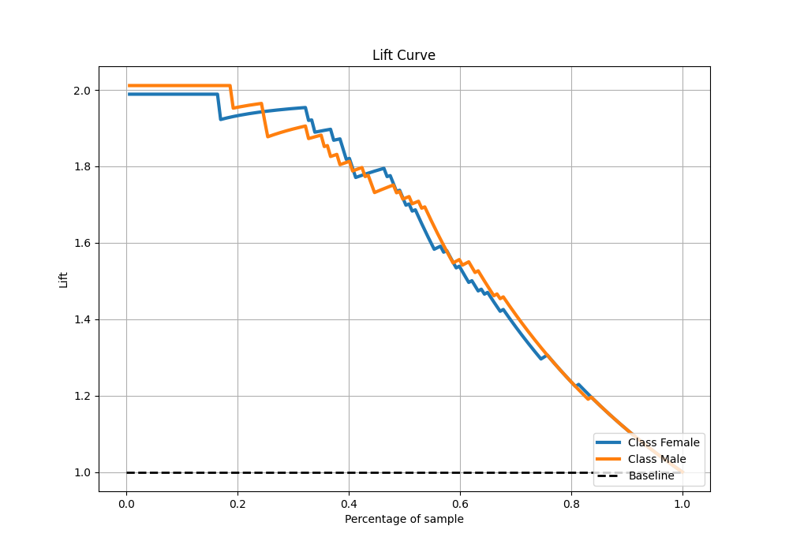

# Summary of 5_Default_NeuralNetwork

[<< Go back](../README.md)

## Neural Network
- **n_jobs**: -1
- **dense_1_size**: 32
- **dense_2_size**: 16
- **learning_rate**: 0.05
- **explain_level**: 2

## Validation
 - **validation_type**: split
 - **train_ratio**: 0.75
 - **shuffle**: True
 - **stratify**: True

## Optimized metric
logloss

## Training time

6.5 seconds

## Metric details
|           |    score |     threshold |
|:----------|---------:|--------------:|
| logloss   | 0.450741 | nan           |
| auc       | 0.932457 | nan           |
| f1        | 0.874317 |   0.475117    |
| accuracy  | 0.870056 |   0.475117    |
| precision | 0.883117 |   0.876395    |
| recall    | 1        |   2.81663e-13 |
| mcc       | 0.742545 |   0.475117    |

## Metric details with threshold from accuracy metric
|           |    score |   threshold |
|:----------|---------:|------------:|
| logloss   | 0.450741 |  nan        |
| auc       | 0.932457 |  nan        |
| f1        | 0.874317 |    0.475117 |
| accuracy  | 0.870056 |    0.475117 |
| precision | 0.842105 |    0.475117 |
| recall    | 0.909091 |    0.475117 |
| mcc       | 0.742545 |    0.475117 |

## Confusion matrix (at threshold=0.475117)
|                   |   Predicted as Female |   Predicted as Male |
|:------------------|----------------------:|--------------------:|
| Labeled as Female |                    74 |                  15 |
| Labeled as Male   |                     8 |                  80 |

## Learning curves

## Permutation-based Importance

## Confusion Matrix

## Normalized Confusion Matrix

## ROC Curve

## Kolmogorov-Smirnov Statistic

## Precision-Recall Curve

## Calibration Curve

## Cumulative Gains Curve

## Lift Curve

[<< Go back](../README.md)
