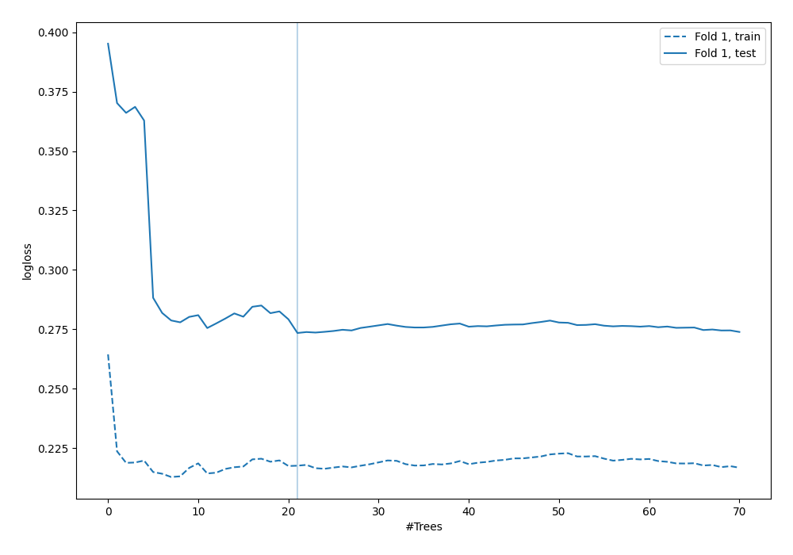
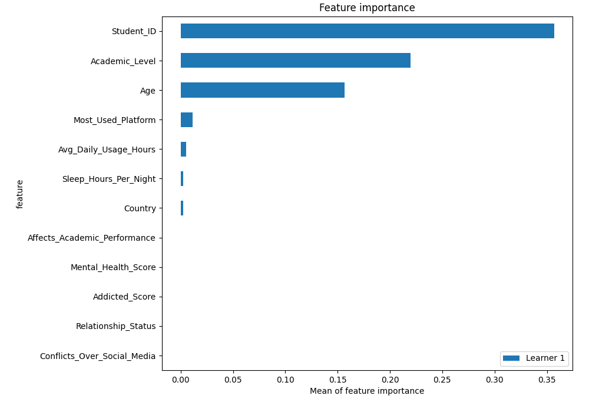
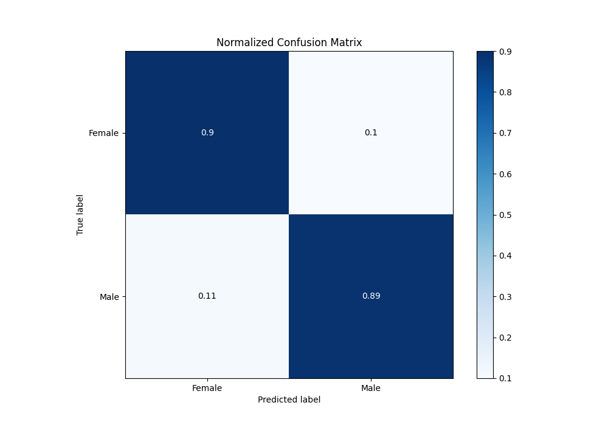
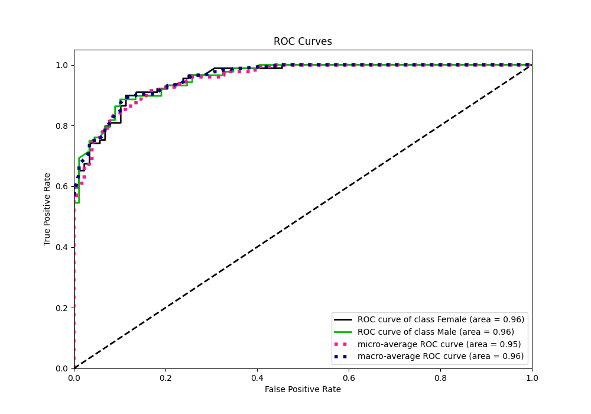
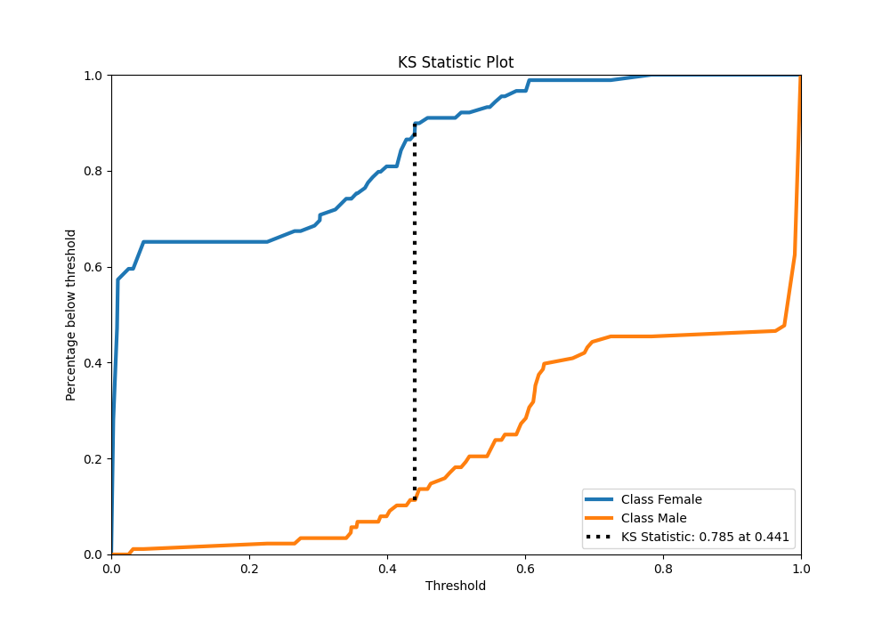
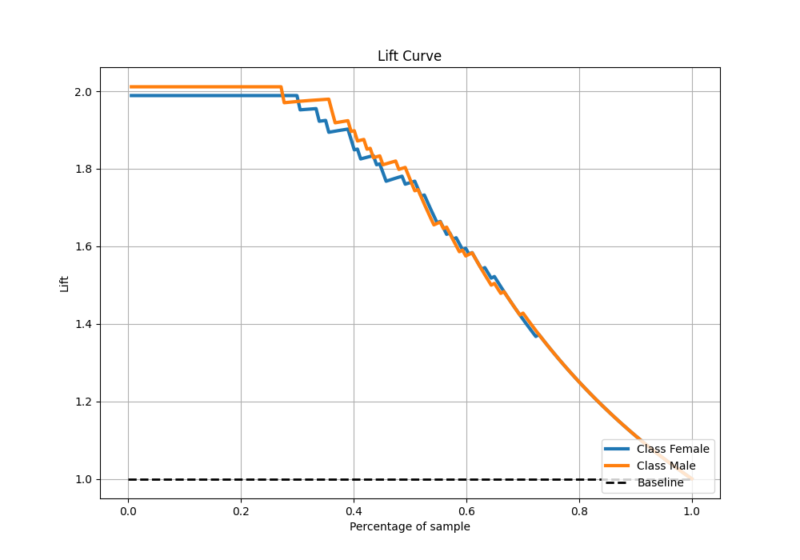

# Summary of 6_Default_RandomForest

[<< Go back](../README.md)

## Random Forest
- **n_jobs**: -1
- **criterion**: gini
- **max_features**: 0.9
- **min_samples_split**: 30
- **max_depth**: 4
- **eval_metric_name**: logloss
- **explain_level**: 2

## Validation
 - **validation_type**: split
 - **train_ratio**: 0.75
 - **shuffle**: True
 - **stratify**: True

## Optimized metric
logloss

## Training time

9.2 seconds

## Metric details
|           |    score |    threshold |
|:----------|---------:|-------------:|
| logloss   | 0.273491 | nan          |
| auc       | 0.956716 | nan          |
| f1        | 0.891429 |   0.443537   |
| accuracy  | 0.892655 |   0.443537   |
| precision | 0.911392 |   0.510638   |
| recall    | 1        |   0.00270485 |
| mcc       | 0.78534  |   0.443537   |

## Metric details with threshold from accuracy metric
|           |    score |   threshold |
|:----------|---------:|------------:|
| logloss   | 0.273491 |  nan        |
| auc       | 0.956716 |  nan        |
| f1        | 0.891429 |    0.443537 |
| accuracy  | 0.892655 |    0.443537 |
| precision | 0.896552 |    0.443537 |
| recall    | 0.886364 |    0.443537 |
| mcc       | 0.78534  |    0.443537 |

## Confusion matrix (at threshold=0.443537)
|                   |   Predicted as Female |   Predicted as Male |
|:------------------|----------------------:|--------------------:|
| Labeled as Female |                    80 |                   9 |
| Labeled as Male   |                    10 |                  78 |

## Learning curves

## Permutation-based Importance

## Confusion Matrix

## Normalized Confusion Matrix

## ROC Curve

## Kolmogorov-Smirnov Statistic

## Precision-Recall Curve

## Calibration Curve

## Cumulative Gains Curve

## Lift Curve

[<< Go back](../README.md)
