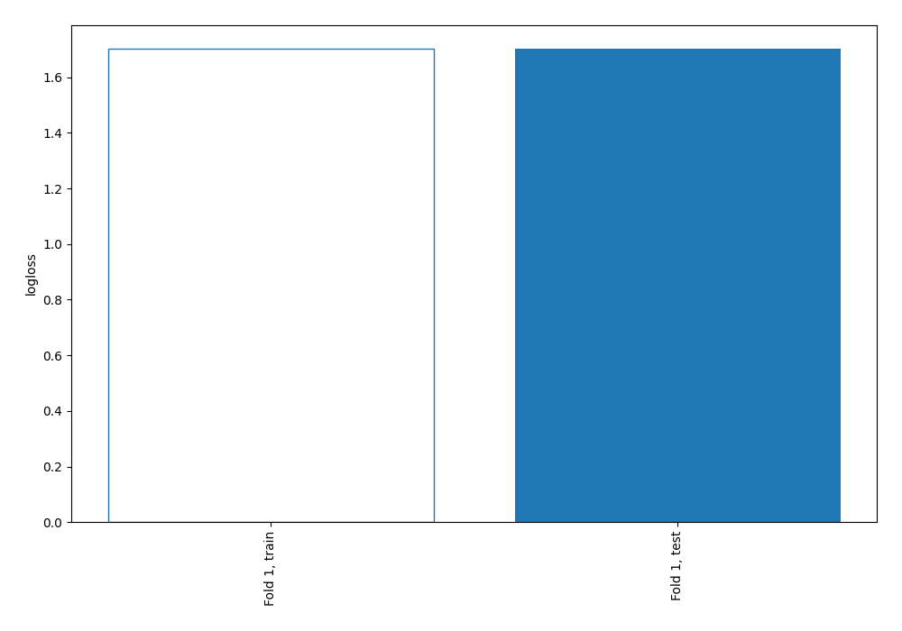
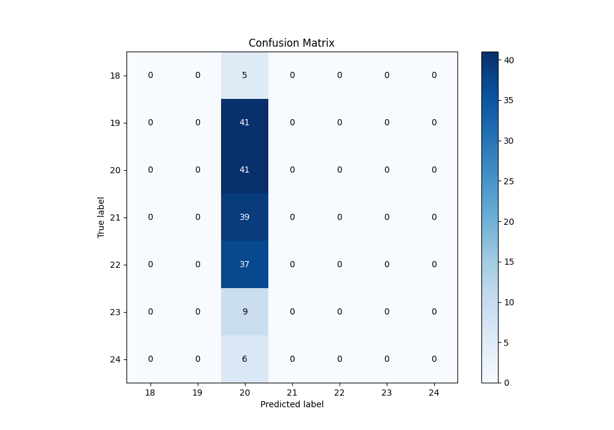
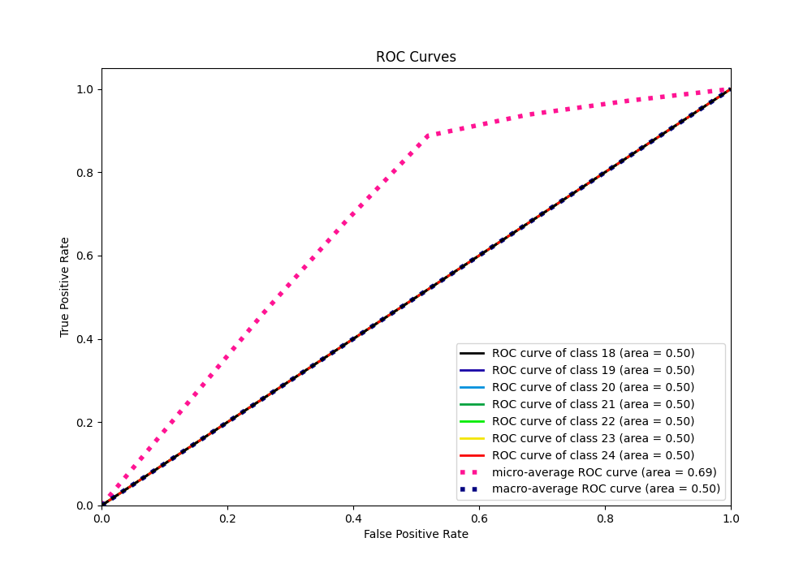
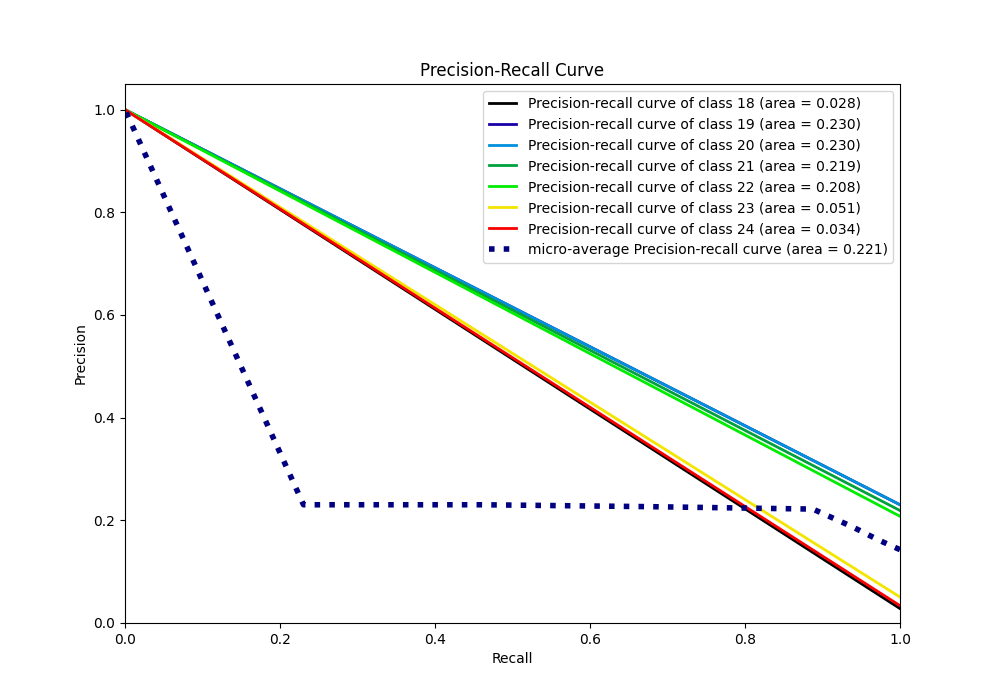

# Summary of 1_Baseline

[<< Go back](../README.md)

## Baseline Classifier (Baseline)
- **n_jobs**: -1
- **num_class**: 7
- **explain_level**: 2

## Validation
 - **validation_type**: split
 - **train_ratio**: 0.75
 - **shuffle**: True
 - **stratify**: True

## Optimized metric
logloss

## Training time

1.0 seconds

### Metric details
|           |   18 |   19 |        20 |   21 |   22 |   23 |   24 |   accuracy |   macro avg |   weighted avg |   logloss |
|:----------|-----:|-----:|----------:|-----:|-----:|-----:|-----:|-----------:|------------:|---------------:|----------:|
| precision |    0 |    0 |  0.230337 |    0 |    0 |    0 |    0 |   0.230337 |   0.0329053 |      0.0530552 |   1.70142 |
| recall    |    0 |    0 |  1        |    0 |    0 |    0 |    0 |   0.230337 |   0.142857  |      0.230337  |   1.70142 |
| f1-score  |    0 |    0 |  0.374429 |    0 |    0 |    0 |    0 |   0.230337 |   0.0534899 |      0.0862449 |   1.70142 |
| support   |    5 |   41 | 41        |   39 |   37 |    9 |    6 |   0.230337 | 178         |    178         |   1.70142 |

## Confusion matrix
|               |   Predicted as 18 |   Predicted as 19 |   Predicted as 20 |   Predicted as 21 |   Predicted as 22 |   Predicted as 23 |   Predicted as 24 |
|:--------------|------------------:|------------------:|------------------:|------------------:|------------------:|------------------:|------------------:|
| Labeled as 18 |                 0 |                 0 |                 5 |                 0 |                 0 |                 0 |                 0 |
| Labeled as 19 |                 0 |                 0 |                41 |                 0 |                 0 |                 0 |                 0 |
| Labeled as 20 |                 0 |                 0 |                41 |                 0 |                 0 |                 0 |                 0 |
| Labeled as 21 |                 0 |                 0 |                39 |                 0 |                 0 |                 0 |                 0 |
| Labeled as 22 |                 0 |                 0 |                37 |                 0 |                 0 |                 0 |                 0 |
| Labeled as 23 |                 0 |                 0 |                 9 |                 0 |                 0 |                 0 |                 0 |
| Labeled as 24 |                 0 |                 0 |                 6 |                 0 |                 0 |                 0 |                 0 |

## Learning curves

## Confusion Matrix

## Normalized Confusion Matrix

## ROC Curve

## Precision Recall Curve

[<< Go back](../README.md)
