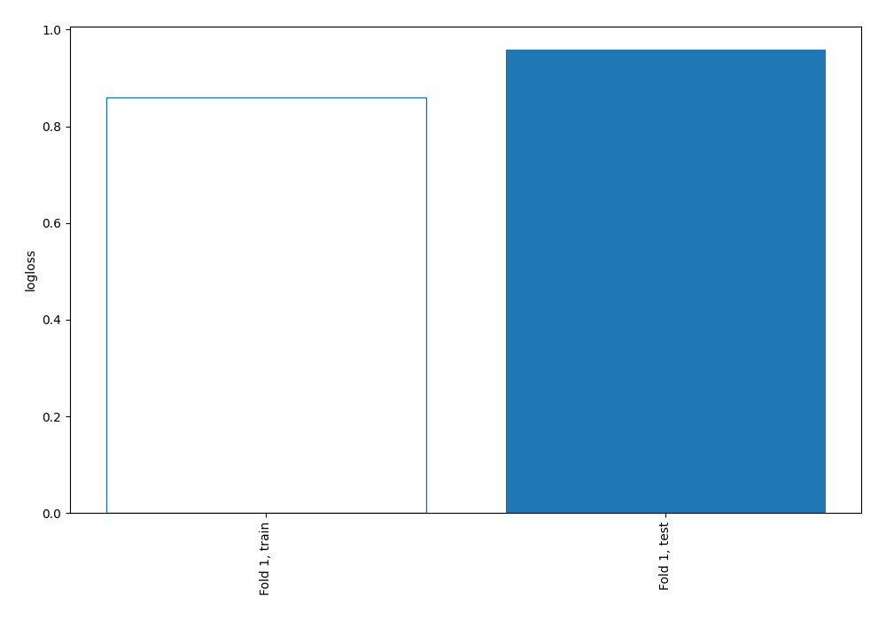
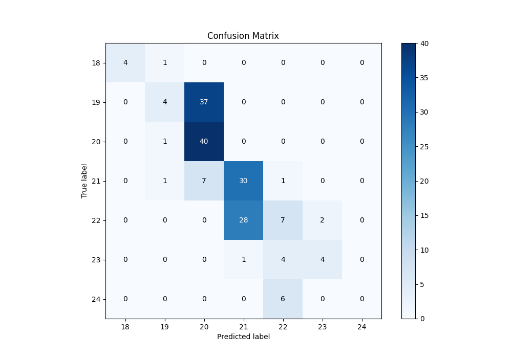

# Summary of 2_DecisionTree

[<< Go back](../README.md)

## Decision Tree
- **n_jobs**: -1
- **criterion**: gini
- **max_depth**: 3
- **num_class**: 7
- **explain_level**: 2

## Validation
 - **validation_type**: split
 - **train_ratio**: 0.75
 - **shuffle**: True
 - **stratify**: True

## Optimized metric
logloss

## Training time

73.6 seconds

### Metric details
|           |       18 |        19 |       20 |        21 |        22 |       23 |   24 |   accuracy |   macro avg |   weighted avg |   logloss |
|:----------|---------:|----------:|---------:|----------:|----------:|---------:|-----:|-----------:|------------:|---------------:|----------:|
| precision | 1        |  0.571429 |  0.47619 |  0.508475 |  0.388889 | 0.666667 |    0 |        0.5 |    0.51595  |       0.495347 |  0.958713 |
| recall    | 0.8      |  0.097561 |  0.97561 |  0.769231 |  0.189189 | 0.444444 |    0 |        0.5 |    0.468005 |       0.5      |  0.958713 |
| f1-score  | 0.888889 |  0.166667 |  0.64    |  0.612245 |  0.254545 | 0.533333 |    0 |        0.5 |    0.44224  |       0.424795 |  0.958713 |
| support   | 5        | 41        | 41       | 39        | 37        | 9        |    6 |        0.5 |  178        |     178        |  0.958713 |

## Confusion matrix
|               |   Predicted as 18 |   Predicted as 19 |   Predicted as 20 |   Predicted as 21 |   Predicted as 22 |   Predicted as 23 |   Predicted as 24 |
|:--------------|------------------:|------------------:|------------------:|------------------:|------------------:|------------------:|------------------:|
| Labeled as 18 |                 4 |                 1 |                 0 |                 0 |                 0 |                 0 |                 0 |
| Labeled as 19 |                 0 |                 4 |                37 |                 0 |                 0 |                 0 |                 0 |
| Labeled as 20 |                 0 |                 1 |                40 |                 0 |                 0 |                 0 |                 0 |
| Labeled as 21 |                 0 |                 1 |                 7 |                30 |                 1 |                 0 |                 0 |
| Labeled as 22 |                 0 |                 0 |                 0 |                28 |                 7 |                 2 |                 0 |
| Labeled as 23 |                 0 |                 0 |                 0 |                 1 |                 4 |                 4 |                 0 |
| Labeled as 24 |                 0 |                 0 |                 0 |                 0 |                 6 |                 0 |                 0 |

## Learning curves

## Permutation-based Importance

## Confusion Matrix

## Normalized Confusion Matrix

## ROC Curve

## Precision Recall Curve

[<< Go back](../README.md)
