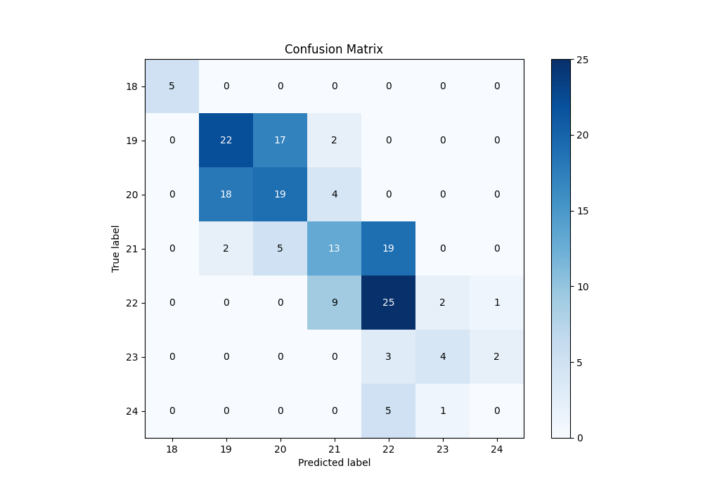
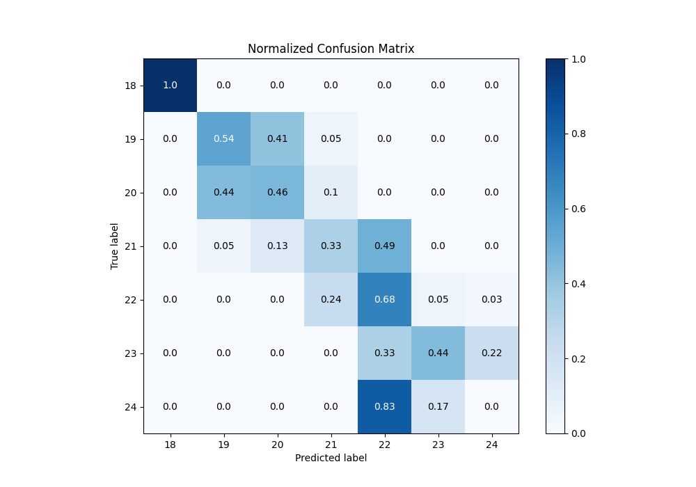

# Summary of 4_Default_Xgboost

[<< Go back](../README.md)

## Extreme Gradient Boosting (Xgboost)
- **n_jobs**: -1
- **objective**: multi:softprob
- **eta**: 0.075
- **max_depth**: 6
- **min_child_weight**: 1
- **subsample**: 1.0
- **colsample_bytree**: 1.0
- **eval_metric**: mlogloss
- **num_class**: 7
- **explain_level**: 2

## Validation
 - **validation_type**: split
 - **train_ratio**: 0.75
 - **shuffle**: True
 - **stratify**: True

## Optimized metric
logloss

## Training time

5.3 seconds

### Metric details
|           |   18 |        19 |        20 |        21 |        22 |       23 |   24 |   accuracy |   macro avg |   weighted avg |   logloss |
|:----------|-----:|----------:|----------:|----------:|----------:|---------:|-----:|-----------:|------------:|---------------:|----------:|
| precision |    1 |  0.52381  |  0.463415 |  0.464286 |  0.480769 | 0.571429 |    0 |   0.494382 |    0.50053  |       0.486037 |  0.935928 |
| recall    |    1 |  0.536585 |  0.463415 |  0.333333 |  0.675676 | 0.444444 |    0 |   0.494382 |    0.49335  |       0.494382 |  0.935928 |
| f1-score  |    1 |  0.53012  |  0.463415 |  0.38806  |  0.561798 | 0.5      |    0 |   0.494382 |    0.491913 |       0.484021 |  0.935928 |
| support   |    5 | 41        | 41        | 39        | 37        | 9        |    6 |   0.494382 |  178        |     178        |  0.935928 |

## Confusion matrix
|               |   Predicted as 18 |   Predicted as 19 |   Predicted as 20 |   Predicted as 21 |   Predicted as 22 |   Predicted as 23 |   Predicted as 24 |
|:--------------|------------------:|------------------:|------------------:|------------------:|------------------:|------------------:|------------------:|
| Labeled as 18 |                 5 |                 0 |                 0 |                 0 |                 0 |                 0 |                 0 |
| Labeled as 19 |                 0 |                22 |                17 |                 2 |                 0 |                 0 |                 0 |
| Labeled as 20 |                 0 |                18 |                19 |                 4 |                 0 |                 0 |                 0 |
| Labeled as 21 |                 0 |                 2 |                 5 |                13 |                19 |                 0 |                 0 |
| Labeled as 22 |                 0 |                 0 |                 0 |                 9 |                25 |                 2 |                 1 |
| Labeled as 23 |                 0 |                 0 |                 0 |                 0 |                 3 |                 4 |                 2 |
| Labeled as 24 |                 0 |                 0 |                 0 |                 0 |                 5 |                 1 |                 0 |

## Learning curves

## Permutation-based Importance

## Confusion Matrix

## Normalized Confusion Matrix

## ROC Curve

## Precision Recall Curve

[<< Go back](../README.md)
