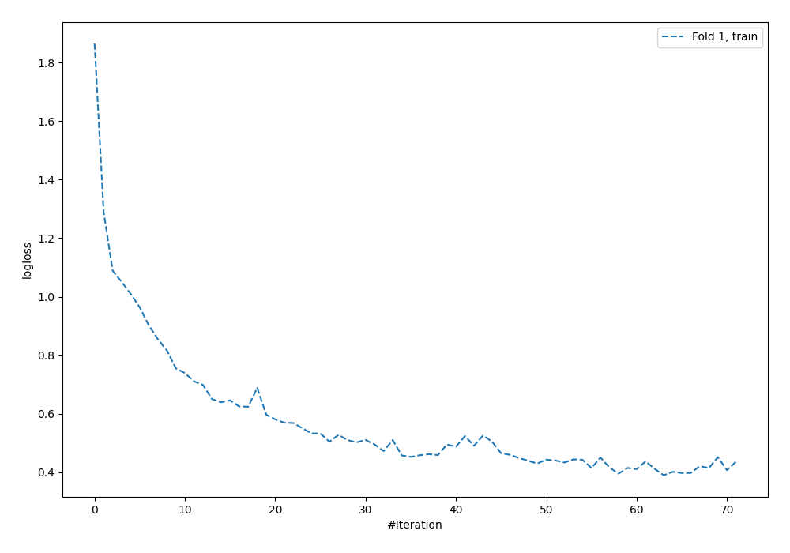
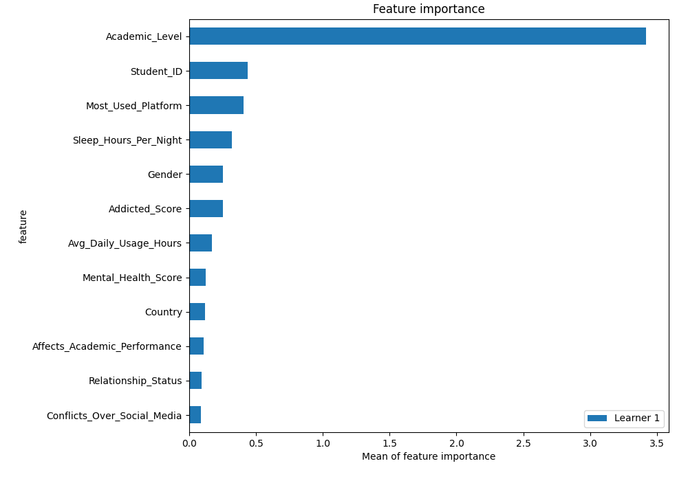
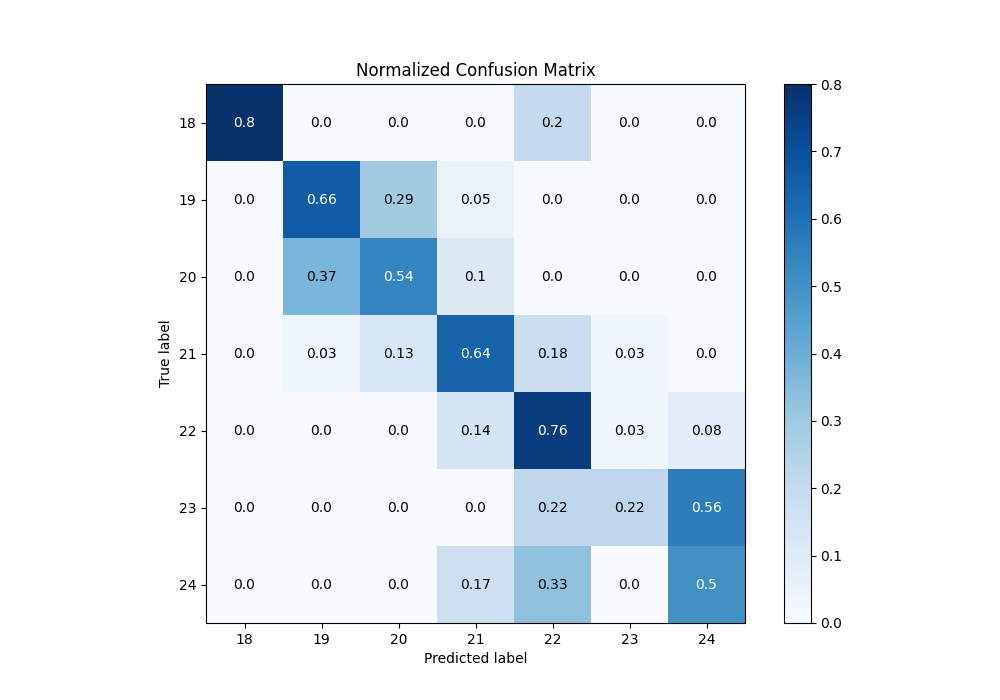
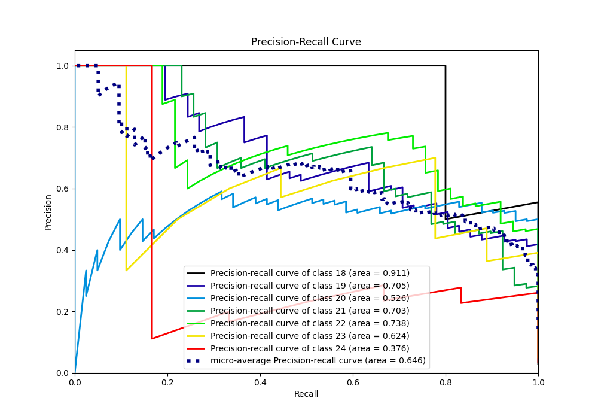

# Summary of 5_Default_NeuralNetwork

[<< Go back](../README.md)

## Neural Network
- **n_jobs**: -1
- **dense_1_size**: 32
- **dense_2_size**: 16
- **learning_rate**: 0.05
- **num_class**: 7
- **explain_level**: 2

## Validation
 - **validation_type**: split
 - **train_ratio**: 0.75
 - **shuffle**: True
 - **stratify**: True

## Optimized metric
logloss

## Training time

2.3 seconds

### Metric details
|           |       18 |        19 |        20 |        21 |        22 |       23 |       24 |   accuracy |   macro avg |   weighted avg |   logloss |
|:----------|---------:|----------:|----------:|----------:|----------:|---------:|---------:|-----------:|------------:|---------------:|----------:|
| precision | 1        |  0.627907 |  0.564103 |  0.675676 |  0.7      | 0.5      | 0.272727 |   0.623596 |    0.620059 |       0.630675 |  0.947287 |
| recall    | 0.8      |  0.658537 |  0.536585 |  0.641026 |  0.756757 | 0.222222 | 0.5      |   0.623596 |    0.587875 |       0.623596 |  0.947287 |
| f1-score  | 0.888889 |  0.642857 |  0.55     |  0.657895 |  0.727273 | 0.307692 | 0.352941 |   0.623596 |    0.58965  |       0.622503 |  0.947287 |
| support   | 5        | 41        | 41        | 39        | 37        | 9        | 6        |   0.623596 |  178        |     178        |  0.947287 |

## Confusion matrix
|               |   Predicted as 18 |   Predicted as 19 |   Predicted as 20 |   Predicted as 21 |   Predicted as 22 |   Predicted as 23 |   Predicted as 24 |
|:--------------|------------------:|------------------:|------------------:|------------------:|------------------:|------------------:|------------------:|
| Labeled as 18 |                 4 |                 0 |                 0 |                 0 |                 1 |                 0 |                 0 |
| Labeled as 19 |                 0 |                27 |                12 |                 2 |                 0 |                 0 |                 0 |
| Labeled as 20 |                 0 |                15 |                22 |                 4 |                 0 |                 0 |                 0 |
| Labeled as 21 |                 0 |                 1 |                 5 |                25 |                 7 |                 1 |                 0 |
| Labeled as 22 |                 0 |                 0 |                 0 |                 5 |                28 |                 1 |                 3 |
| Labeled as 23 |                 0 |                 0 |                 0 |                 0 |                 2 |                 2 |                 5 |
| Labeled as 24 |                 0 |                 0 |                 0 |                 1 |                 2 |                 0 |                 3 |

## Learning curves

## Permutation-based Importance

## Confusion Matrix

## Normalized Confusion Matrix

## ROC Curve

## Precision Recall Curve

[<< Go back](../README.md)
