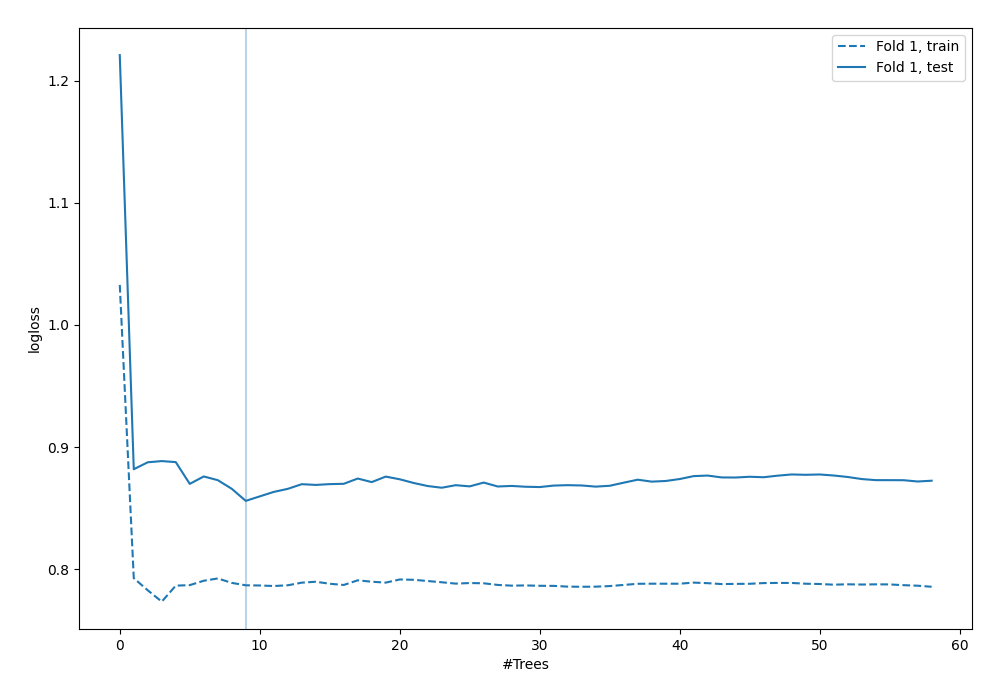
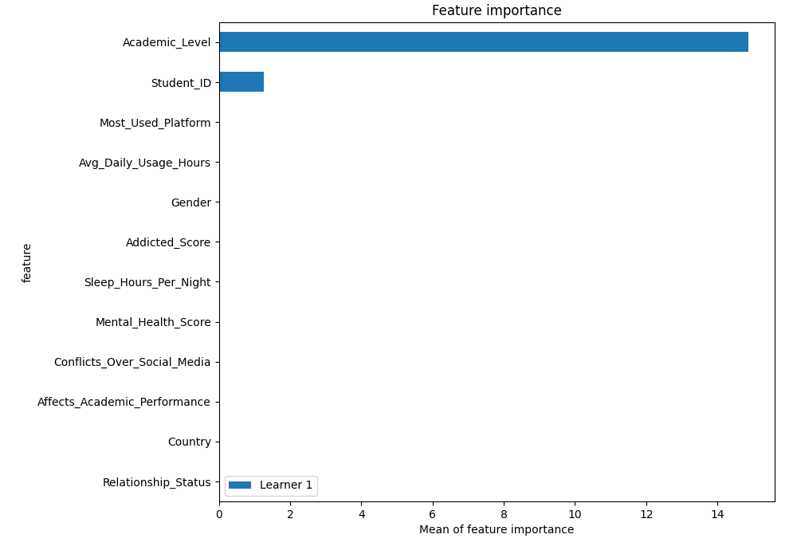
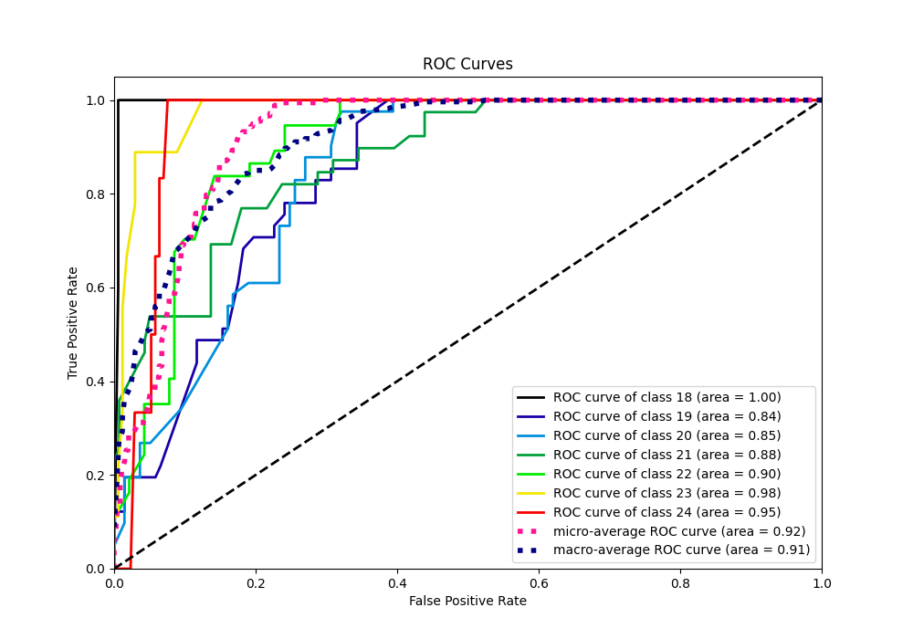

# Summary of 6_Default_RandomForest

[<< Go back](../README.md)

## Random Forest
- **n_jobs**: -1
- **criterion**: gini
- **max_features**: 0.9
- **min_samples_split**: 30
- **max_depth**: 4
- **eval_metric_name**: logloss
- **num_class**: 7
- **explain_level**: 2

## Validation
 - **validation_type**: split
 - **train_ratio**: 0.75
 - **shuffle**: True
 - **stratify**: True

## Optimized metric
logloss

## Training time

6.9 seconds

### Metric details
|           |       18 |        19 |        20 |        21 |        22 |       23 |       24 |   accuracy |   macro avg |   weighted avg |   logloss |
|:----------|---------:|----------:|----------:|----------:|----------:|---------:|---------:|-----------:|------------:|---------------:|----------:|
| precision | 0.714286 |  0.545455 |  0.492308 |  0.536585 |  0.448276 | 0.75     | 0.2      |        0.5 |    0.526701 |       0.51451  |  0.856031 |
| recall    | 1        |  0.292683 |  0.780488 |  0.564103 |  0.351351 | 0.333333 | 0.333333 |        0.5 |    0.522184 |       0.5      |  0.856031 |
| f1-score  | 0.833333 |  0.380952 |  0.603774 |  0.55     |  0.393939 | 0.461538 | 0.25     |        0.5 |    0.49622  |       0.484382 |  0.856031 |
| support   | 5        | 41        | 41        | 39        | 37        | 9        | 6        |        0.5 |  178        |     178        |  0.856031 |

## Confusion matrix
|               |   Predicted as 18 |   Predicted as 19 |   Predicted as 20 |   Predicted as 21 |   Predicted as 22 |   Predicted as 23 |   Predicted as 24 |
|:--------------|------------------:|------------------:|------------------:|------------------:|------------------:|------------------:|------------------:|
| Labeled as 18 |                 5 |                 0 |                 0 |                 0 |                 0 |                 0 |                 0 |
| Labeled as 19 |                 2 |                12 |                27 |                 0 |                 0 |                 0 |                 0 |
| Labeled as 20 |                 0 |                 9 |                32 |                 0 |                 0 |                 0 |                 0 |
| Labeled as 21 |                 0 |                 1 |                 6 |                22 |                10 |                 0 |                 0 |
| Labeled as 22 |                 0 |                 0 |                 0 |                19 |                13 |                 1 |                 4 |
| Labeled as 23 |                 0 |                 0 |                 0 |                 0 |                 2 |                 3 |                 4 |
| Labeled as 24 |                 0 |                 0 |                 0 |                 0 |                 4 |                 0 |                 2 |

## Learning curves

## Permutation-based Importance

## Confusion Matrix

## Normalized Confusion Matrix

## ROC Curve

## Precision Recall Curve

[<< Go back](../README.md)
