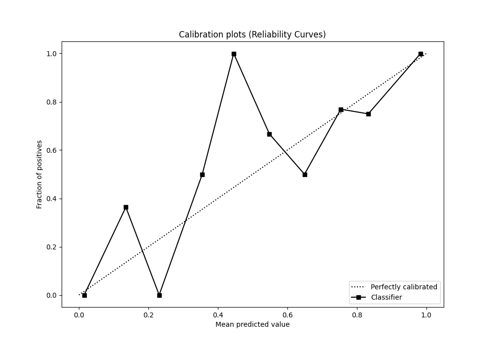
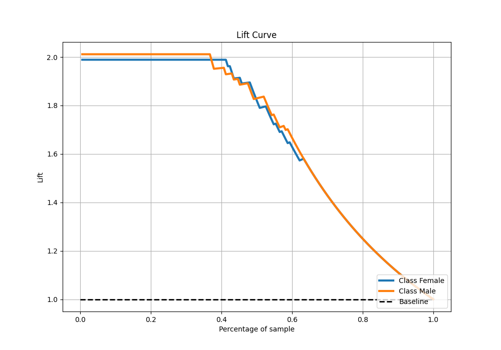

# Summary of Ensemble

[<< Go back](../README.md)

## Ensemble structure
| Model                   |   Weight |
|:------------------------|---------:|
| 4_Default_Xgboost       |        5 |
| 5_Default_NeuralNetwork |        1 |

## Metric details
|           |    score |    threshold |
|:----------|---------:|-------------:|
| logloss   | 0.177868 | nan          |
| auc       | 0.981486 | nan          |
| f1        | 0.933333 |   0.355478   |
| accuracy  | 0.932203 |   0.355478   |
| precision | 0.949367 |   0.713068   |
| recall    | 1        |   0.00255891 |
| mcc       | 0.865321 |   0.355478   |

## Metric details with threshold from accuracy metric
|           |    score |   threshold |
|:----------|---------:|------------:|
| logloss   | 0.177868 |  nan        |
| auc       | 0.981486 |  nan        |
| f1        | 0.933333 |    0.355478 |
| accuracy  | 0.932203 |    0.355478 |
| precision | 0.913043 |    0.355478 |
| recall    | 0.954545 |    0.355478 |
| mcc       | 0.865321 |    0.355478 |

## Confusion matrix (at threshold=0.355478)
|                   |   Predicted as Female |   Predicted as Male |
|:------------------|----------------------:|--------------------:|
| Labeled as Female |                    81 |                   8 |
| Labeled as Male   |                     4 |                  84 |

## Learning curves

## Confusion Matrix

## Normalized Confusion Matrix

## ROC Curve

## Kolmogorov-Smirnov Statistic

## Precision-Recall Curve

## Calibration Curve

## Cumulative Gains Curve

## Lift Curve

[<< Go back](../README.md)
