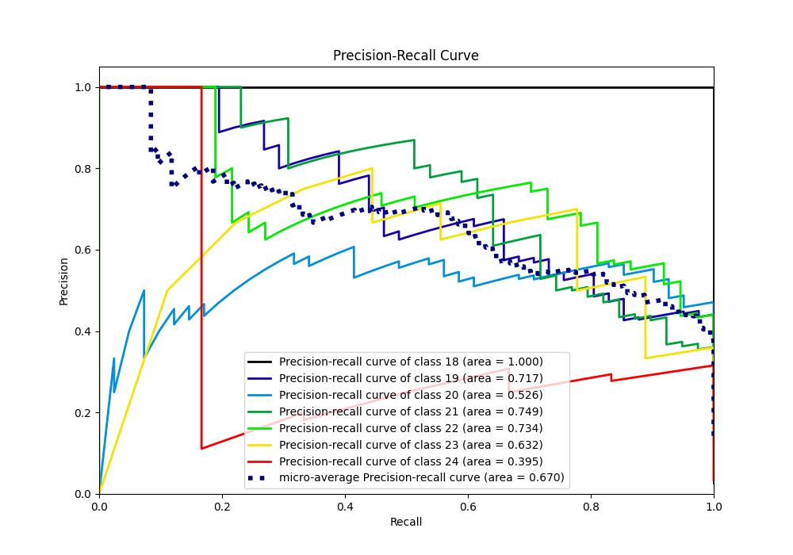

# Summary of Ensemble

[<< Go back](../README.md)

## Ensemble structure
| Model                   |   Weight |
|:------------------------|---------:|
| 2_DecisionTree          |        1 |
| 5_Default_NeuralNetwork |        2 |
| 6_Default_RandomForest  |        1 |

### Metric details
|           |   18 |        19 |        20 |        21 |        22 |       23 |       24 |   accuracy |   macro avg |   weighted avg |   logloss |
|:----------|-----:|----------:|----------:|----------:|----------:|---------:|---------:|-----------:|------------:|---------------:|----------:|
| precision |    1 |  0.583333 |  0.567568 |  0.71875  |  0.636364 | 0.5      | 0.2      |   0.606742 |    0.600859 |       0.614964 |  0.812864 |
| recall    |    1 |  0.682927 |  0.512195 |  0.589744 |  0.756757 | 0.111111 | 0.333333 |   0.606742 |    0.569438 |       0.606742 |  0.812864 |
| f1-score  |    1 |  0.629213 |  0.538462 |  0.647887 |  0.691358 | 0.181818 | 0.25     |   0.606742 |    0.562677 |       0.600331 |  0.812864 |
| support   |    5 | 41        | 41        | 39        | 37        | 9        | 6        |   0.606742 |  178        |     178        |  0.812864 |

## Confusion matrix
|               |   Predicted as 18 |   Predicted as 19 |   Predicted as 20 |   Predicted as 21 |   Predicted as 22 |   Predicted as 23 |   Predicted as 24 |
|:--------------|------------------:|------------------:|------------------:|------------------:|------------------:|------------------:|------------------:|
| Labeled as 18 |                 5 |                 0 |                 0 |                 0 |                 0 |                 0 |                 0 |
| Labeled as 19 |                 0 |                28 |                11 |                 2 |                 0 |                 0 |                 0 |
| Labeled as 20 |                 0 |                18 |                21 |                 2 |                 0 |                 0 |                 0 |
| Labeled as 21 |                 0 |                 2 |                 5 |                23 |                 9 |                 0 |                 0 |
| Labeled as 22 |                 0 |                 0 |                 0 |                 5 |                28 |                 1 |                 3 |
| Labeled as 23 |                 0 |                 0 |                 0 |                 0 |                 3 |                 1 |                 5 |
| Labeled as 24 |                 0 |                 0 |                 0 |                 0 |                 4 |                 0 |                 2 |

## Learning curves

## Confusion Matrix

## Normalized Confusion Matrix

## ROC Curve

## Precision Recall Curve

[<< Go back](../README.md)
